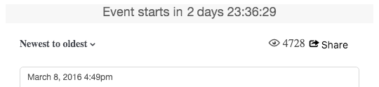

# CSS 클래스 저장{#storify-css-classes}

Storify 앱에 사용할 수 있는 CSS 클래스입니다.

CSS를 사용하여 Storify Apps를 사용자 정의하여 페이지와의 보다 완벽한 통합을 실현하고 자신만의 스타일 시트를 사용하여 기본 CSS를 재정의하면 됩니다. 이 섹션에서는 사용 가능한 CSS 사용자 지정에 대해 설명합니다.

## 작성자 요소 {#section_tdy_hsh_xz}

게시물의 작성자 아바타, 작성자 이름 및 타임스탬프에 대한 스타일을 사용자 지정할 수 있습니다.

| 클래스 | 설명 |
|---|---|
| .s-author-name | Author |
| .s-author-avatar | 작가의 아바타 |
| .s-img | 작가의 아바타 이미지 |
| .s-timestamp | 날짜 컨텐츠의 타임스탬프가 게시되었습니다. |

## 머리글 요소 {#section_nbv_gsh_xz}

스토리 페이지의 머리글 섹션을 사용자 정의할 수 있습니다.

| **클래스** | **설명** |
|---|---|
| .super-header | 기본 헤더 |
| .outer-header | 기본 머리글 행 1 |
| .s 카운트다운 | 기본 헤더 행 1 카운트다운 타이머 |
| .s lightness | 기본 헤더 행 1 "라이브" 상태 |
| .base-header | 기본 머리글 행 2 |
| .s-dropdown | 기본 머리글 행 2 정렬 드롭다운 트리거. |
| .s-dropdown-menu | 기본 머리글 행 2 정렬 드롭다운 메뉴. |
| .s-dropdown-triangle | 기본 머리글 행 2 드롭다운 메뉴 삽입 삽입. |
| .s-dropdown-option | 기본 머리글 행 2 드롭다운 메뉴 항목을 정렬합니다. |
| .s-views | 기본 머리글 행 2개의 보기 수입니다. |
| .s-share-button 버튼 | 기본 머리글 행 2 공유 단추. |
| .s-share-menu | 기본 머리글 행 2 공유 메뉴. |

## 게시물 요소 {#section_lrs_fsh_xz}

게시물의 스토리 요소에 대한 스타일링을 사용자 지정할 수 있습니다.

| **클래스** | **설명** |
|---|---|
| .s-liveblog | 전체 스토리 요소의 컨테이너 |
| .s-post | 게시물 컨테이너 |
| .s-modal-content | 포스트 모달 컨테이너 |
| .s-element-content | 게시물 내의 모든 컨텐츠 요소 |
| .s-element-text ul | 텍스트 요소 |
| .s-element-text h2 | 텍스트 요소 헤드라인 |
| .s-element-text p | 텍스트 요소 단락 |
| .s-element-text ul | 텍스트 요소 순서가 없는 목록 |
| .s-element-text ol | 텍스트 요소 순차 목록 |
| .s-element-text li | 텍스트 요소 목록 항목 |
| .s-element-text blockquote | Blockquote |
| .s-element-text blockquote:before | 블록 인용 시작 아이콘 |
| .s-element-text blockquote:after | 블록 인용 끝 아이콘 |
| .s-element-image | 인라인 이미지 요소 컨테이너 |
| .s-img | `` 요소 |
| .s-image-caption | 소셜 미디어에 있는 이미지 및 비디오에 대한 캡션(예:Instagram 이미지) |
| .s-upload-image-caption | 스토리 편집기를 통해 업로드된 이미지 및 비디오에 대한 캡션 |
| .s-element-video | 비디오 요소 |
| .s-element-quote | 견적 요소(예:텍스트가 포함된 트윗 전용) |
| .s-element-quote-image | 이미지 요소가 포함된 견적(예:이미지가 포함된 트윗) |
| .s-element-quote-video | 비디오 요소가 포함된 견적(예:비디오가 포함된 트윗) |
| .s-link-body | 견적 내에서 링크 미리 보기(예:미리 보기를 통한 트윗) |

## 바닥글 요소 {#section_ozc_zrh_xz}

각 개별 게시물에 대해 바닥글 섹션을 사용자 지정할 수 있습니다.

| **클래스** | **설명** |
|---|---|
| .s-post-footer | 게시물의 바닥글입니다. |
| .s-sidenotes a | 게시물 바닥글의 [사이드노트] 단추 |
| .s like | 게시물 바닥글의 "좋아요" 단추. |
