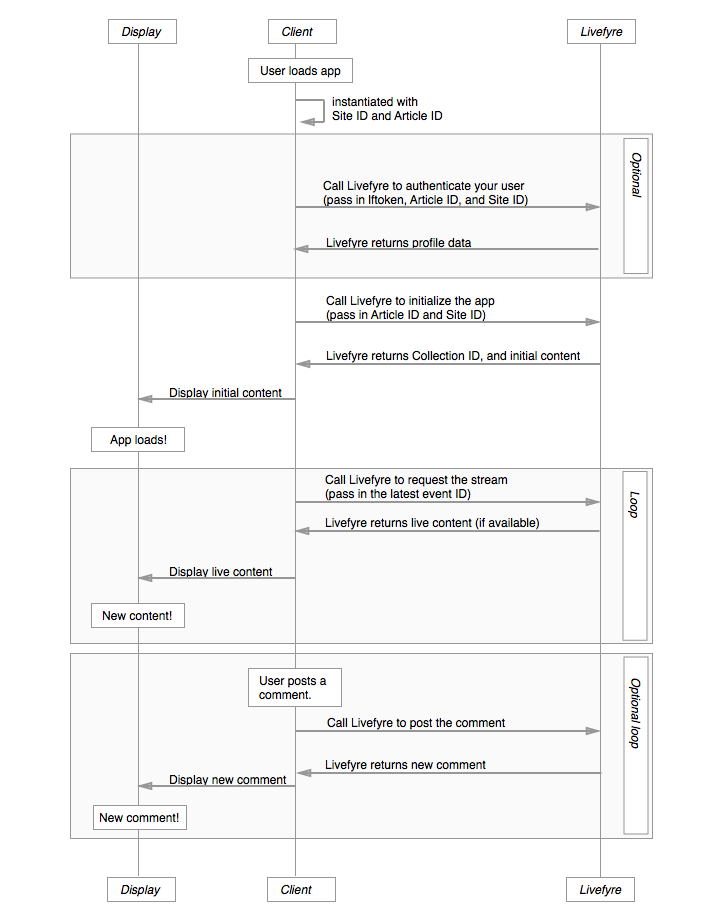

# 아키텍처{#architecture}

Livefyre 규칙과 Livefyre가 콘텐츠를 구성하는 방법에 대해 알아보십시오.

이 섹션에서는 Livefyre 네트워크 아키텍처에 대한 개요를 제공합니다.

## 네트워크 및 사이트 개요

Livefyre는 네트워크 및 사이트별로 사용자와 컨텐츠를 구성합니다. 모든 네트워크에는 하나 이상의 사용자 계정이 연결되어 있으며 각 네트워크에는 하나 이상의 Livefyre 사이트가 포함될 수 있습니다. Livefyre 사이트는 임의의 컬렉션 그룹입니다. 하나의 컬렉션이 CMS에서 하나의 아티클 ID에 매핑됩니다.

## 네트워크 이해 {#section_hqt_4m4_xz}

여러 도메인을 보유한 고객은 단일 Livefyre 네트워크를 사용하여 모든 도메인에서 사용자 계정을 공유할 수 있습니다. 서로 다른 도메인에 대해 별도의 사용자 계정을 유지하려는 고객은 별도의 Livefyre 네트워크가 필요합니다.

구성 설정은 사이트, 네트워크 및 컬렉션에 적용할 수 있습니다(위의 그림에서 대화라고 함).

>[!NOTE]
>
>일부 설정은 네트워크 수준에서만 사용할 수 있습니다(예: 이메일 알림 환경 설정, 이메일 주소, 이메일 사용자 정의 로고). 이러한 설정을 각 도메인에 대해 다르게 설정하려면 여러 네트워크를 사용해야 합니다.

## 사이트 이해 {#section_vjw_nm4_xz}

사이트는 아티클의 임의 그룹화입니다. 그룹화는 다양한 컨텐츠 그룹에 다른 중재자를 할당할 수 있으므로 유용합니다. 중재자와 소유자는 콘텐트를 중재하고 네트워크 또는 사이트 수준에서 관리자 설정을 구성하도록 설정할 수 있습니다. 일부 중재자가 특정 컬렉션만 보도록 하려는 경우 이러한 컬렉션은 별도의 Livefyre 사이트로 설정될 수 있습니다.

>[!NOTE]
>
>사용자 지정 네트워크 하에서 보유하고 있는 사이트 수에는 제한이 없습니다.

## 앱 시퀀스 다이어그램 {#section_mw2_lm4_xz}

Livefyre 제공 끝점으로 사용자 지정 기능을 구현하려는 경우든, 단순히 문제를 디버깅해야 하는 경우든, Livefyre 앱 요청/응답 흐름이 어떻게 작동하는지 이해하는 데 도움이 됩니다.

1. 클라이언트가 사이트를 방문하면 사이트 ID 및 아티클 ID로 Livefyre 앱을 인스턴스화합니다.
1. 사용자를 인증하려는 경우(트래픽 평가뿐만 아니라 사이트 보호에 중요함) Livefyre 사이트 정보와 사용자 프로필 토큰을 Livefyre로 전송합니다.
1. Livefyre를 사이트 ID 및 아티클 ID로 전송하여 앱을 초기화합니다.

   Livefyre는 초기 컨텐츠를 반환합니다.

   이 콘텐츠를 페이지로 전송하고 앱을 표시합니다.

1. 페이지에 표시된 컨텐츠를 업데이트하려면 페이지에서 최신 이벤트 ID로 Livefyre를 전송합니다. 사용 가능한 새 컨텐츠가 있으면 반환됩니다.

   페이지를 새 콘텐츠로 다시 로드하고 프로세스를 무기한 반복합니다.

1. 사용자가 새 컨텐츠를 게시할 수 있도록 허용하는 경우 사이트에 새 컨텐츠가 게시되면 이벤트를 트리거하여 Livefyre에 컨텐츠를 게시합니다. Livefyre는 사이트를 업데이트하는 데 사용할 수 있는 업데이트된 스트림을 반환합니다.
