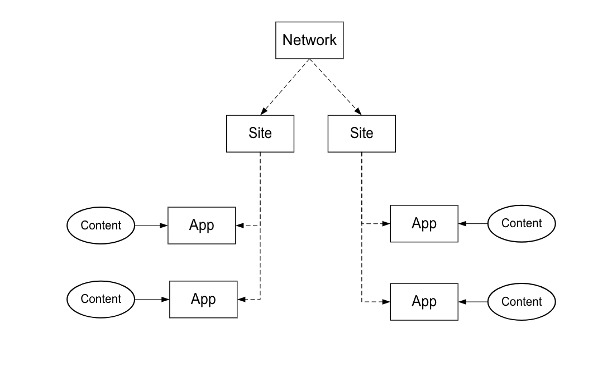

# 구현 프로세스{#implementation-process}

Livefyre 구현 시간은 구현 및 작업 범위에 따라 다릅니다.

## Livefyre 네트워크 아키텍처 개요 {#section_dgj_l32_rbb}

Livefyre는 네트워크 아키텍처 토론에 다음 용어를 사용합니다.

* 네트워크. Livefyre를 사용하려는 최상위 도메인.
* 사이트. 네트워크의 일부인 하위 도메인 또는 사이트 섹션
* 앱. 사이트의 컨텐츠 렌더링. 시각화 앱 (Mosaic, Carousel, Feature Card 등) 를 사용하여 시각적으로 앱에 콘텐츠를 표시합니다. 또는 대화 앱 (댓글, 평가, 채팅 등) 를 사용하여 텍스트 형식으로 변환할 수도 있습니다. 사이트에 하나 이상의 앱을 배치할 수 있습니다.
* 스트림. 스트림은 소셜 미디어 및 기타 사이트를 검색하여 앱에서 중재 또는 직접 출판을 위해 컨텐츠를 자동으로 수집하는 필터입니다.
* 컨텐츠 (예: UGC, 댓글). 앱에 표시되는 내용. 컨텐츠는 시각적 (예: 사진 또는 비디오), 오디오 전용 또는 텍스트일 수 있습니다.

다음 다이어그램은 네트워크, 사이트, 앱 및 컨텐츠 간의 관계를 보여줍니다.

콘텐츠 중재, 사용자 관리 등을 위한 중앙 대시보드를 제공하는 Livefyre 인스턴스가 있습니다. Livefyre 인스턴스에 액세스하려면 CSM에 문의하십시오.

## 통합 단계 {#section_s2j_d2x_tz}

Livefyre를 통합하는 세 가지 주요 단계는 다음과 같습니다.

* 앱 통합

   Livefyre를 구현할 때 구현 스타일은 사용 사례에 따라 달라집니다. for [more implementation type](/help/implementation/c-getting-started/c-implementation-process/c-app-integration-types.md#c_app_integration_types).

* 인증 통합

   대화 앱 및 사이트에서 최종 사용자 인증이 필요한 기타 앱에 대해 기존 사용자 관리 시스템과 Livefyre를 통합해야 합니다. 현재 사용자 관리 도구를 사용하지 않는 경우 Livefyre ID를 사용할 수 있습니다. Livefyre [ID에 대한 자세한 내용, 소개 및 설정 방법을](/help/implementation/c-livefyre-identity-comp/c-livefyre-identity-comp.md#c_livefyre_identity)참조하십시오.

* 사용자 정의

   맞춤화는 선택 사항이지만 대부분의 고객은 브랜드에 맞게 앱을 맞춤화할 수 있습니다.

