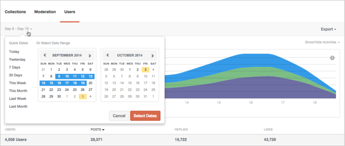
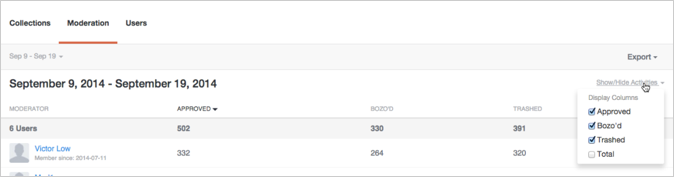
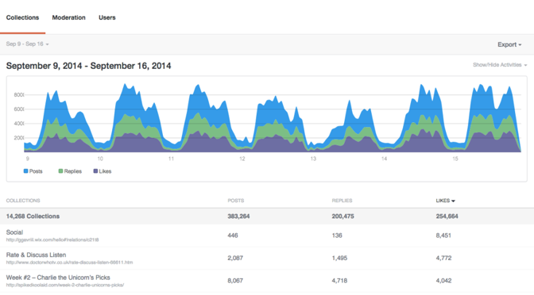
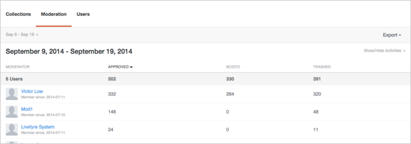
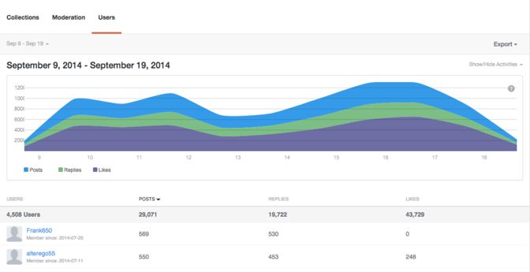

# Analytics{#analytics}

사이트의 사용자, 컨텐츠 및 중재자 활동을 분석합니다.

## Analytics {#topic_22D8FAE581CD440EA02B1595520F60C2}

사이트의 사용자, 컨텐츠 및 중재자 활동을 분석합니다.

Livefyre Analytics 에서는 대화, 중재 및 사용자 데이터에 대한 대시보드를 쉽게 읽을 수 있는 네트워크 데이터에 액세스할 수 있습니다. 이러한 대시보드를 사용하여 활동을 모니터링하고 사이트에서 빠른 분석을 실행할 수 있습니다.

대시보드는 사이트, 날짜 및 활동별로 필터링할 수 있습니다. 창의 왼쪽 상단에 있는 네트워크 풀다운을 사용하여 표시할 사이트를 선택합니다. 생성된 후에는 열 헤더를 클릭하여 정렬하거나 그래프 위로 마우스를 가져가 데이터 포인트에 대한 보다 구체적인 정보를 얻을 수 있습니다.

이 페이지에서는 다음 사항에 대해 설명합니다.

* 대시보드에 대한 [날짜 범위](https://answers.livefyre.com/livefyre-studio-version-1/studio/analytics/#DateRange) 선택
* [사용 가능한 활동 표시/숨기기](https://answers.livefyre.com/livefyre-studio-version-1/studio/analytics/#ShowHideActivities)
* [대시보드 데이터 내보내기](https://answers.livefyre.com/livefyre-studio-version-1/studio/analytics/#ExportDashboardData)
* [컬렉션 대시보드](https://answers.livefyre.com/livefyre-studio-version-1/studio/analytics/#CollectionsDashboard)
* [중재 대시보드](https://answers.livefyre.com/livefyre-studio-version-1/studio/analytics/#ModerationDashboard)
* [사용자 대시보드](https://answers.livefyre.com/livefyre-studio-version-1/studio/analytics/#UsersDashboard)

>[!NOTE]
>
>현재 Analytics는 Livefyre 코어 앱 및 중재에서 발생한 활동을 지원합니다. 이러한 대시보드에 포함된 대부분의 활동은 Livefyre JavaScript 이벤트를 통해서도 [사용할 수 있으며, 이 JavaScript 이벤트는](https://answers.livefyre.com/developers/reference/app-customizations/javascript-events/)사용자 지정 또는 타사 분석 도구를 강화하는 데 사용할 수 있습니다.

## 날짜 범위 {#concept_798C438120E643B6BE262C9997DC87C4}

표시할 범위를 선택하려면 [날짜 풀다운] 를 클릭합니다. 제공된 달력에서 빠른 날짜를 사용하거나 시작 및 종료 날짜를 선택합니다.

빠른 날짜:

* **오늘:** 현재 날짜의 아침 자정부터 마지막 완료 시간까지 데이터를 표시합니다.
* **어제:** 이전 24 시간 데이터를 표시합니다.
* **7 일:** 오늘 포함하지 않고 이전 7 일 데이터를 표시합니다.
* **30 일:** 오늘 포함하지 않는 이전 30 일 데이터를 표시합니다.
* **이번 주:** 마지막 일요일 아침의 자정부터 마지막 완료 시간까지 데이터를 표시합니다.
* **이번 달:** 현재 월의 첫 날 아침 (현재 월의 마지막 날 아침) 까지 데이터를 표시합니다.
* **지난 주:** 지난 주 데이터를 표시합니다.
* **지난 달:** 지난 달의 데이터를 표시합니다.

## 활동 표시/숨기기 {#concept_022D9851CBCE4A2FB80D0AE52A23744D}

활동은 댓글, 플래그 지정, 공유, 중재 등 사용자가 사이트에서 취하는 작업입니다. 활동 **표시/숨기기** 풀다운을 사용하여 대시보드에 포함시킬 활동을 선택합니다.

>[!NOTE]
>
>필터에 대한 새 이벤트를 선택하면 URL를 변경하지 않고 페이지가 다시 렌더링됩니다.

사용 가능한 활동은 대시보드 유형 및 내보내기별로 다르며 다음을 포함할 수 있습니다.

* **게시물:** 현재 날짜의 아침 자정부터 마지막 완료 시간까지 데이터를 표시합니다.
* **답글:** 이전 24 시간 데이터를 표시합니다.
* **좋아요:** 오늘 포함하지 않고 이전 7 일 데이터를 표시합니다.
* **좋아요 취소:** 오늘 포함하지 않는 이전 30 일 데이터를 표시합니다.
* **Contains media:** 마지막 일요일 아침의 자정부터 마지막 완료 시간까지 데이터를 표시합니다.
* **게시물에 사진 업로드가 있음:** 현재 월의 첫 날 아침 (현재 월의 마지막 날 아침) 까지 데이터를 표시합니다.
* **게시물에 링크가 있습니다.** 지난 주 데이터를 표시합니다.
* **게시물에 @ mentions:** 지난 달의 데이터를 표시합니다.
* **승인됨:** 지난 달의 데이터를 표시합니다.
* **Bozo'd:** 지난 달의 데이터를 표시합니다.
* **흩어 뿌리기:** 지난 달의 데이터를 표시합니다.
* **중재 총계:** 지난 달의 데이터를 표시합니다.

## 대시보드 데이터 내보내기 {#concept_730DB61A9F894BE6BFB34E0E2A421ED3}

대시보드 데이터를 CSV 파일로 내보내려면 **내보내기** 풀다운 메뉴를 사용합니다.

* 일별 다이제스트 (컬렉션만): 각 컬렉션에 대한 마지막 전체 주의 일별 설정을 내보냅니다.
* 표 데이터: 롤업된 모든 컬렉션 데이터 (모든 열과 현재 보고서의 모든 행) 를 내보냅니다.
* 원시 데이터: 현재 롤업된 보고서를 만드는 데 사용된 모든 개별 이벤트를 내보냅니다.

>[!NOTE]
>
>이러한 보고서는 내보내는 데 몇 분 정도 걸릴 수 있습니다. 모든 타임스탬프는 Unix 시간입니다.

## 컬렉션 {#concept_228D8E5553784DB8BABF3819A5FF0345}

컬렉션 대시보드에는 컬렉션별 사용자 활동이 표시되므로 가장 많이 사용되는 컨텐츠 (및 가장 적게 사용되는 컨텐츠) 를 확인할 수 있습니다. 나열된 각 컬렉션에는 페이지를 찾을 수 있는 페이지에 대한 링크가 포함됩니다.

## 중재 {#concept_98689B1E804B43CEA21E3F456107CCD9}

중재 대시보드에서는 중재자별로 이벤트를 목록화하여 활동을 평가할 수 있습니다. 이 보고서를 사용하여 가장 활동적인 중재자 및 가장 일반적인 중재 작업을 찾습니다.

>[!NOTE]
>
>자동화된 Livefyre 중재 활동이 중재자 이름 Livefyre 시스템에 대해 나열됩니다.

## 사용자 {#concept_D1A83E31C7B5467F9C844CBF9A740E12}

사용자 대시보드는 사용자별 사이트 활동을 보여주므로 개별 사용자가 사이트와 상호 작용하는 방식을 분석할 수 있습니다. 이 대시보드를 사용하여 사이트에서 가장 활동적인 사용자를 찾고 가장 인기 있는 사이트 활동을 평가하십시오.

