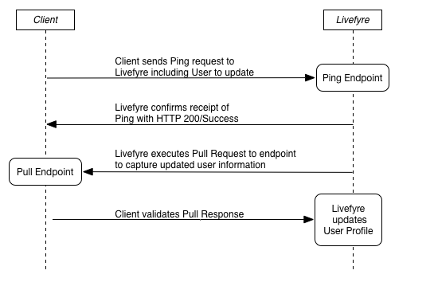

# Ping for Pull을 사용하여 Livefyre와 동기화{#sync-with-livefyre-using-ping-for-pull}

Ping for Pull을 사용하여 사용자 관리 시스템과 Livefyre를 동기화할 수 있습니다.

일반적으로 ***웹 사이트*** /앱 사용자가 자신의 프로파일을 업데이트(표시 이름, 아바타 등)할 때마다 Livefyre를 ***Ping할 수 있으며, Livefyre는*** 해당 사용자의 업데이트된 프로파일을 가져옵니다.

풀 시퀀스 Ping:

1. 고객은 Ping 요청을 Livefyre(업데이트할 사용자 포함)로 보냅니다.
1. Livefyre가 HTTP 200/Success를 사용하여 Ping을 수신했음을 확인합니다.
1. Livefyre는 가져오기 요청을 처리합니다.
1. Livefyre 큐 풀 요청을 표시합니다.
1. Livefyre는 끝점에 대한 가져오기 요청을 실행하여 업데이트된 사용자 정보를 캡처합니다.
1. 고객은 풀 응답을 받고 유효성을 검사합니다.
1. Livefyre는 가져오기 끝점에 포함된 외부 프로필 정보로 원격 프로필을 업데이트합니다.

사용자가 프로필 정보를 업데이트할 때마다 Ping Livefyre를 실행합니다. 풀(Pull) 완료 시간은 네트워크 로드에 따라 달라질 수 있지만 1~10분 내에 사용자 정보를 업데이트합니다. 업데이트된 프로필 변경 사항이 Livefyre Studio &gt; 사용자 내에서 먼저 표시됩니다.

업데이트된 프로필 정보는 다음 두 이벤트 후에 Livefyre 앱에 표시됩니다.

* 사용자가 로그아웃한 다음 다시 앱에 로그인합니다. userAuthToken의 표시 이름 값이 풀 업데이트에 대한 Ping보다 우선합니다. 사용자가 로그아웃/로그인으로 토큰을 새로 고쳐서 세션을 업데이트합니다.

   프로필 정보가 업데이트될 때 새 userAuthTokens를 생성하려면 SSO authDelegate를 사용하여 사용자를 로그아웃한 다음 백그라운드에서 다시 로그인하십시오.

* 컬렉션에 대한 부트스트랩 업데이트는 업데이트된 정보를 가져옵니다(최대 5-10분마다).

사용자 프로필 시스템에 대한 Ping을 구현하려면 다음을 수행하십시오.

1. [풀 끝점을](#t_build_the_pull_endpoint)만듭니다.

   >[!NOTE]
   >
   >Livefyre 라이브러리에는 사용자 프로필을 최신 상태로 유지할 수 있는 syncUser 메서드가 포함되어 있습니다. Livefyre 라이브러리를 사용하는 경우 다음 두 단계를 건너뜁니다.

1. [Studio에서 풀 끝점을 등록합니다](#register_the_endpoint_with_studio).
1. [Ping을](#t_build_the_ping)빌드합니다.
1. [풀 응답을 위한 Ping을 만듭니다].(#reference_n3x_pzb_mz)
