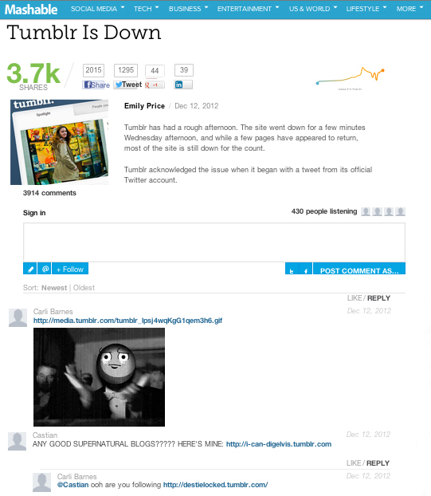

# 댓글{#comments}

앱에 실시간 주석을 임베드할 수 있습니다.

댓글은 기본 댓글을 실시간 대화로 대체합니다. Adobe의 소셜 통합 기능을 사용하면 Twitter 및 Facebook에서 게시물에 대한 모든 대화를 간편하게 캡처하고 사용자의 친구를 대화로 끌어들일 수 있습니다.

Mashable는 댓글을 사용하여 토론에 대한 사용자 참여도를 높입니다. 리치 미디어 업로드, 소셜 공유, 리스너 카운트, SSO (Single Sign-On) 도움말 등 다양한 기능을 사용하여 대화에 손쉽게 기여할 수 있습니다.

<!-- 

c_comments_app.dita

 -->

