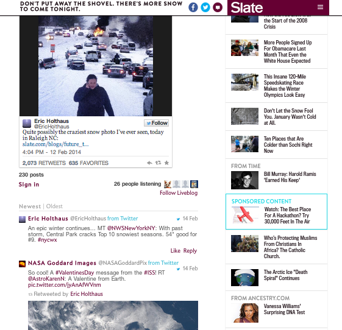

# 라이브 블로그{#live-blog}

Live 블로그를 사용하면 작성자와 편집자는 실시간 업데이트를 게시하여 사이트를 매력적인 라이브 뉴스 소스로 탈바꿈시킬 수 있습니다.

이미지, 비디오, 오디오 및 임베디드 컨텐츠가 포함된 팀이 게시한 게시물은 새로운 대화와 스레드를 위한 소스가 됩니다. 라이브 블로그는 제품 공개, 수상 프로그램 및 스포츠 이벤트를 위해 배포할 때 완벽합니다.

라이브 블로그는 다음과 같은 방법으로 주석과 다릅니다.

* 소유자 및 중재자만 댓글 상자를 보고 최상위 수준의 게시물을 만들 수 있습니다.
* 블로거 전용 경험을 만들기 위해 사용자 답글을 끌 수 있습니다.
* 사용자는 컴퓨터나 모바일 디바이스에서 사진을 작성하거나 업로드하거나 임베드 가능한 링크를 게시할 수 있습니다.
* 주석 글꼴은 더 크고 아바타는 내용을 강조하기 위해 더 작아집니다.
* 원하는 경우 아바타를 비활성화할 수 있습니다.

또 다른 눈보라 속에서 Slate는 독자들에게 동부 해안에 날씨의 날씨와 관련된 즉각적인 업데이트를 제공하기를 원했다. Slate Editors는 라이브 블로그를 사용하여 자신의 사진, 사용자 트윗 및 눈 속에 대한 정보를 포함하여 폭풍에 대한 업데이트를 바로 공유할 수 있었습니다. The Live Blog was so useful that it made the front page of Slate's site.

