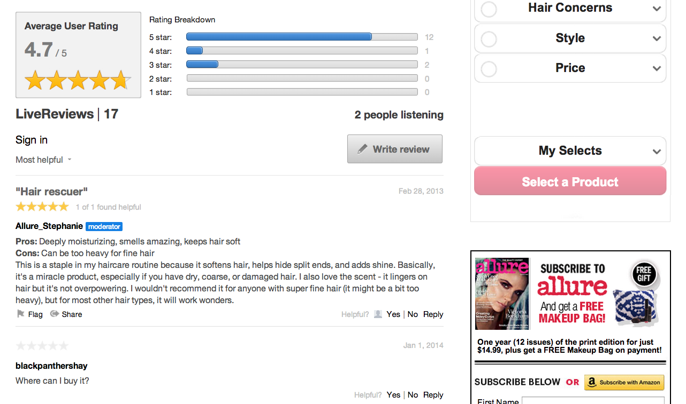

# 평가{#reviews}

웹 사이트에서 실시간으로 콘텐츠를 평가하고 검토할 수 있습니다.

리뷰를 통해 사용자는 웹 사이트에서 제품, 서비스, 기사 또는 콘텐츠를 실시간으로 손쉽게 평가하고 검토할 수 있습니다.

검토 앱에 게시된 각 검토는 한 줄 검토 제목, 본문과 숫자 등급으로 구성됩니다. 리뷰 앱은 제목 및 등급을 포함하여 사용자의 의견을 수량화하고 해당 제품 또는 서비스에 대한 사용자 경험에 대한 요약을 제공합니다.

기본 검토 앱은 컬렉션의 컬렉션과 컬렉션의 평균 사용자 등급 및 등급 분류를 표시하는 요약 섹션으로 구성됩니다. 사용자는 실시간으로 검토를 읽고 인터랙션할 수 있습니다.

Allure는 평가를 사용하여 사용자가 사용하는 제품에 대한 평점과 의견에 기여하도록 초대합니다. Allure는 검토를 통해 고객으로부터 중요한 사용자 피드백을 수집할 수 있습니다.

## 평가 기능 {#section_awq_xph_21b}

Reviews는 이 앱에만 적용되는 여러 기능을 제공합니다.

* 스트림 위의 트렌드 (스타 등급 및 평균 등급 요약) 를 시각적으로 시각적으로 표현합니다.
* 별 수 및 이미지 수, 등급 하위 요소 (예: 장성, 단점) 및 다중 등급 카테고리를 포함한 사용자 지정 가능한 등급 인터페이스.
* 리뷰 컬렉션에 대한 평균 사용자 등급과 등급 분류의 그래픽 시각화를 사용하여 검토 내용을 요약합니다.
* 보기를 위해 목록 맨 위에 사용자 검토를 유지하면서 표시할 큐 검토를 수행합니다.
* 사용자가 검토 작업에 대한 유용성에 투표한 다음 가장 유용한 등급과 가장 높은 평가를 기반으로 정렬할 수 있습니다.
* 모바일 친화적인 인터페이스

