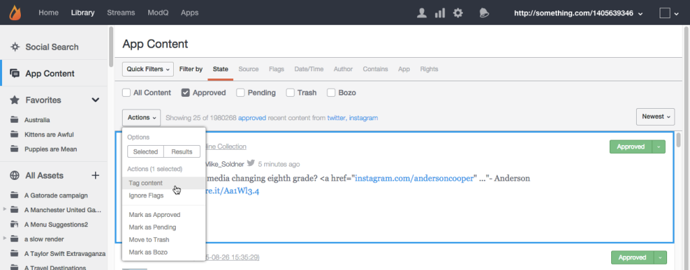
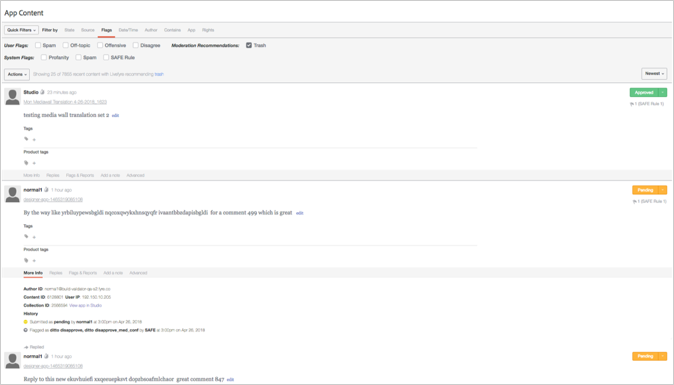
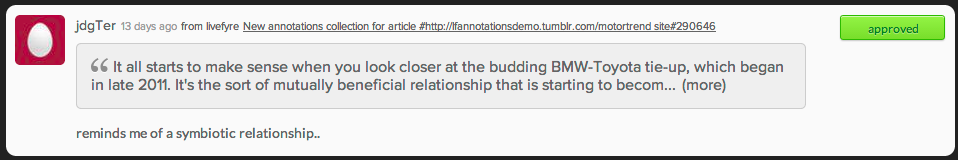

# 앱 콘텐츠를 사용하여 컨텐츠 중재{#moderate-content-using-app-content}

라이브러리의 앱 콘텐츠 탭에서 앱 전체에 게시된 콘텐츠를 중재할 수 있습니다.

## 컨텐츠 중재 {#section_md5_sqm_zz}

[앱 내용] 패널을 사용하여 목록의 내용을 변경하거나 작성자의 상태를 변경하거나 노트를 추가하여 나열된 콘텐트를 중재합니다. 컨텐츠를 중재하려면 나열된 컨텐츠 위에 마우스를 놓고 사용 가능한 마커를 변경하거나 **[!UICONTROL pulldown]** 메뉴를 사용하여 선택한 개별 또는 여러 개의 선택된 컨텐츠에 대한 상태를 변경합니다.

앱 컨텐츠에서 다음을 수행할 수 있습니다.

* **[!UICONTROL Tag Content]**. 개별 **[!UICONTROL Tag Content]** 또는 여러 컨텐츠에 동시에 태그를 추가하려면 선택합니다.

* **[!UICONTROL Ignore Flags]**. 플래그가 지정된 검색 필터 결과에서 선택한 컨텐츠를 **[!UICONTROL Ignore Flags]** 제외하려면 선택합니다. 항목을 선택해도 **[!UICONTROL Ignore Flags]** 상태는 변경되지 않습니다. 모든 Studio 사용자를 위한 이 검색 필터의 검색 결과에서 IT만 제거합니다.

* **[!UICONTROL Change Content Status]**. 컨텐츠를 클릭한 다음 **[!UICONTROL Actions]** 메뉴를 사용하여 상태를 변경합니다. (명령이나 컨트롤 키를 사용하여 여러 항목을 선택한 다음 메뉴를 사용하여 여러 콘텐트에 대한 상태를 동시에 변경합니다.)

   옵션은 나열된 컨텐츠의 현재 상태에 따라 달라집니다.

   | 현재 상태 | may be change to |
   |---|---|
   | 승인됨 | 보류 중, 휴지통, 보조 |
   | Bozo | 승인됨, 보류 중, 휴지통 |
   | 휴지통 | 승인됨, 보류 중, 보조, 삭제 |
   | 보류 중 | 승인됨, 휴지통, 보조 |

* **[!UICONTROL Save as Assets]**. 선택한 **[!UICONTROL Save as Assets]** 항목을 자산 라이브러리에 저장하거나, 앱에 게시하거나, 작성자로부터 재사용을 요청할 수 있는 고급 옵션 대화 상자를 열려면 선택합니다.

* 권장 사항에 따라 중재합니다. 앱 **[!UICONTROL Moderation Recommendation Indicator]** 내의 콘텐츠를 사용하여 중재 권장 사항이 트렌드될 것으로 인식하는 컨텐츠를 필터링합니다.

   앱 컨텐츠에서 중재 권장 사항은 다음과 같습니다. 

## Sidenotes 컨텐츠 중재 {#section_i2s_nqm_zz}

컨텐츠 패널에서 Sidenotes를 사용한 작업은 다음과 같은 여러 가지 방법으로 다른 유형의 컨텐츠를 사용한 작업과 다릅니다.

* 추가 정보, 답글, 플래그 및 보고서 및 메모 탭을 추가할 수 없습니다.
* Sidenotes 컨텐츠에 태그를 지정하거나 이 컨텐츠에 특혜로 표시할 수 없습니다.

중재할 컨텐츠도 표시할 수 있다는 점에서 다릅니다. 또한 Sienote가 추가되었을 때 선택된 텍스트를 표시하여 컨텍스트에서 컨텐츠를 평가할 수 있습니다.

텍스트 상자를 클릭하여 사용자가 선택한 견적 전체를 포함하도록 확장합니다.

Sidenotes 콘텐츠 중재는 위에서 설명한 대로 일괄 변경 사항과 개별 상태 변경 사항을 모두 허용합니다.

## Livefyre 사용자 중재 {#section_grw_mqm_zz}

Livefyre 사용자가 풀다운 메뉴를 열 수 있는 사용자 이름 위로 마우스를 가져가면 해당 사용자가 자신의 목록을 **[!UICONTROL Ban the User]**보거나, 가져오거나 **[!UICONTROL More Info]**, 볼 **[!UICONTROL Comments]**수 있습니다. 이 메뉴를 클릭하면 스튜디오 **[!UICONTROL Users]** 페이지에서 사용자의 정보 카드가 열립니다.

페이지에서 사용자를 중재하는 방법에 대한 자세한 내용은 **[!UICONTROL Users]** 사용자 modq [조정을 참조하십시오](/help/using/c-features-livefyre/c-about-moderation/t-moderate-users-modq.md#t_moderate_users_modq).
