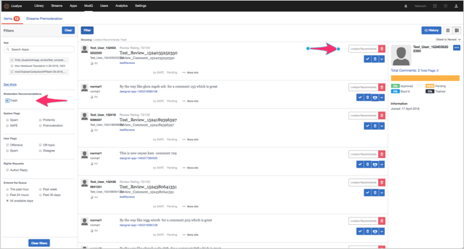

# SAFE 규칙{#safe-rules}

Livefyre 스팸 및 오용 필터링 엔진(SAFE)은 들어오는 모든 콘텐츠를 분석하는 백그라운드 프로세스이며 모든 Livefyre 고객을 위해 제공됩니다.

SAFE는 패턴 규칙 및 통계 모델을 사용하여 스팸, 악용, 모독 및 벌크(반복) 게시물을 감지합니다. 다른 Livefyre 제품, 특히 컨텐츠 중재 도구 및 ModQ에서 수시로 참조되는 것을 확인할 수 있습니다.

>[!NOTE]
>
>SAFE는 벌크 메일 분류를 제외하고 영어로만 제공됩니다. 다른 언어 지원이 필요한 경우 전략 계정 관리자에게 문의하십시오.

## SAFE {#section_k34_4tx_vy}를 사용하는 Studio 구성 요소

SAFE로 적용된 플래그는 다음 Studio 구성 요소와 함께 사용할 수 있습니다.

* 규칙

   SAFE 규칙을 정의하여 내용에 자동으로 플래그를 지정하고 **[!UICONTROL Network Settings]**&#x200B;에서 플래그 지정된 컨텐츠를 처리하는 방법을 정의할 수 있습니다.

   예를 들어, 사이트는 불경스러운 모든 컨텐츠에 대해 매우 낮은 허용치를 설정하고 Propane로 플래그가 지정된 모든 컨텐츠를 Bozo&#39;d로 설정하는 SAFE 규칙을 정의할 수 있습니다.다른 사이트에서는 스트림에 들어가기 전에 프로필 컨텐츠를 사전 중재하도록 설정하는 규칙을 정의할 수 있습니다.

* ModQ

   SAFE 규칙 및 기타 중재 규칙(예: 스팸, 비속어 등)으로 플래그가 지정된 컨텐츠를 ModQ에서 중재할 수 있습니다.

* 라이브러리의 앱 콘텐츠

   SAFE로 플래그가 지정된 컨텐츠는 **[!UICONTROL Library]** 탭의 앱 컨텐츠에 나열됩니다. 컨텐츠를 중재하기 위해 플래그를 기준으로 컨텐츠를 필터링할 수 있습니다.

## 안전 필터 옵션 {#section_pg5_ttx_vy}

SAFE는 필터링된 컨텐츠에 다음 플래그를 적용하고 Livefyre Studio 내에서 규칙을 만들고 컨텐츠를 중재하는 데 사용할 수 있습니다.

* **[!UICONTROL Profanity List]**:일반적인 사용을 기반으로 영어 키워드 목록에 정의된 대로 컨텐츠의 프로파일을 작성합니다.

   비속어 필터는 테스트된 단어 목록을 기반으로, 욕설 언어를 찾습니다. 감지되면 컨텐츠가 프로페인으로 플래그가 지정됩니다.

   >[!NOTE]
   >
   >또한 Livefyre는 사이트 및 네트워크 수준에서 사용자 정의할 수 있는 두 번째 불경사 목록 필터를 제공합니다. 비속어 목록을 사용하여 만든 규칙은 SAFE 비속어 필터에서 파생된 자동화된 규칙보다 우선합니다. 자세한 내용은 설정 문서의 비속어 목록 섹션을 참조하십시오.

* **[!UICONTROL Mild Profanity]**:일반적으로 예의 바른 대화에서는 허용되지 않지만 보통 평상복 대화를 하는 경우에는 허용된다. 일반적으로 이런 단어와 구절은 네트워크 텔레비전에 허용된다.
* **[!UICONTROL Strong Profanity]**:네트워크 텔레비전에서 허용되지 않고 R 등급의 영화와 성숙한 케이블 TV쇼에서 사용되는 욕설과 같은 매우 강력한 언어. 일반적으로 이런 단어들은 예의바르거나 캐주얼한 대화에서 사용되지 않으며, 청자를 해하려는 의도로 무례한 대화에서 언급된다.
* **[!UICONTROL SPAM]**:요청하지 않은, 일반적으로 상업용 컨텐츠. 이 프레임워크는 다양한 기능(주석 컨텐츠 및 URL 포함)을 신뢰하는 통계 모델을 사용하여 컨텐츠 일부를 스팸으로 플래그를 지정합니다. 요청을 통해 스팸 임계값을 조정하여 네트워크 또는 사이트의 스팸 태그 비율을 사용자 정의할 수 있습니다.
* **[!UICONTROL Mild Insult]**:키워드 및 구문 패턴 목록으로 정의된 컨텐트 모욕적.
* **[!UICONTROL Strong Insult]**:키워드 및 구문 패턴 목록으로 정의된 컨텐트 모욕적.
* **[!UICONTROL Hate Speech]**:민족 또는 종교에 근거한 모욕, 특히 대상 그룹이 소수이거나 보호되어 있을 때.
* **[!UICONTROL ALL CAPS]**:모든 대문자로 표시된 텍스트(고함이라고 함).
* **[!UICONTROL Mild Threat]**:보통 다른 사람을 향한 가벼운 모욕의 어떤 종류들을 포함하는 위협이나 모욕. 이 옵션은 가능한 위협을 더 자주 플래그를 지정하지만 **[!UICONTROL Strong Threat]**&#x200B;보다 높은 false/양의 비율도 가집니다.

* **[!UICONTROL Strong Threat]**:한 명 이상의 사람들에게 실행 가능한 신체적인 해를 말하는 심각한 위협이나 모욕. 종종 강한 모욕으로. 이 옵션은 가능한 위협을 덜 플래그를 지정하지만 **[!UICONTROL Mild Threat]**&#x200B;보다 낮은 false/양의 비율도 가집니다.

* **[!UICONTROL Probable Nudity]**:노출이 있을 수 있는 이미지입니다. 이 옵션은 노출이 덜 나타나지만, **[!UICONTROL Possible Nudity]**&#x200B;보다 낮은 거짓 긍정 비율을 갖습니다.

* **[!UICONTROL Possible Nudity]**:노출이 있을 수 있는 이미지입니다. 이 옵션은 노출에 플래그를 더 자주 지정하지만 **[!UICONTROL Probable Nudity]**&#x200B;보다 높은 거짓 긍정 비율을 갖습니다.

* **[!UICONTROL PII]** (개인 식별 정보):사용자를 식별할 수 있는 정보입니다. 여기에는 이메일 주소, 실제 주소, 소셜 보안 번호(미국 고객의 경우), 신용 카드 번호, 암호 또는 사기 행위를 통해 사용하거나 다른 사람의 신원을 얻기 위해 사용할 수 있는 모든 것이 포함될 수 있습니다.
* **[!UICONTROL Livefyre Recommends Trash]** 구문을 사용하는 키-값 쌍으로 전달됩니다. 자동 중재 추천이 거부 컨텐츠를 식별할 때 시스템에서 수행하는 작업을 설정합니다. 

   >[!NOTE]
   >
   >중재 Recommendations을 켜려면 Adobe Livefyre 지원 전문가에게 문의하십시오.

## SAFE {#section_pjy_5tx_vy}에서 catch하지 않은 내용 처리

이 필터에서 포착하지 않은 컨텐츠를 효과적으로 처리할 수 있는 몇 가지 방법이 있습니다. 아래의 옵션은 권장되는 프로세스 순서로 나와 있습니다.

1. 중재자로서, 스트림에서 컨텐츠를 제거합니다.
1. 컨텐츠 일부가 스팸 또는 모욕으로 5명의 사용자가 플래그를 지정한 경우 Bozo로 설정하면 된다는 플래그 규칙을 만듭니다.
1. 원하지 않는 컨텐츠를 게시하는 사용자를 금지하여 모든 컨텐츠가 Bozo 상태로 바로 이동됩니다.
1. 비속어 목록에 항상 필터링되어야 하는 특정 단어를 추가합니다.

>[!NOTE]
>
>중재자가 스팸 필터에 의해 감지된 컨텐츠를 게시하면 여전히 스팸으로 플래그가 지정되지만 자동으로 승인되며 Bozo로 설정되지 않습니다.

컨텐츠의 트렌드 또는 패턴이 SAFE로 검색되지 않는 경우 CSM에 주석 ID와 텍스트를 이메일로 전송하십시오.

이 기능을 사용하는 앱:

* [회전판](/help/using/c-about-apps/c-carousel-app/c-carousel-app.md#c_carousel_app)
* [대화](/help/using/c-about-apps/c-chat-app/c-chat-app.md#c_chat_app)
* [댓글](/help/using/c-about-apps/c-comments/c-comments.md)
* [기능 카드](/help/using/c-about-apps/c-feature-card-app/c-feature-card-app.md#c_feature_card_app)
* [맵](/help/using/c-about-apps/c-map-app/c-map-app.md#c_map_app)
* [미디어 벽](/help/using/c-about-apps/c-media-wall-app/c-media-wall-app.md#c_media_wall_app)
* [모자이크](/help/using/c-about-apps/c-mosaic-app/c-mosaic-app.md#c_mosaic_app)
* [평가](/help/using/c-about-apps/c-reviews-app/c-reviews-app.md#c_reviews_app)
* [사이드노트](/help/using/c-about-apps/c-sidenotes-app/c-sidenotes-app.md#c_sidenotes_app)
* [Storify 2](/help/using/c-about-apps/c-storify2/c-storify2.md#c_storify2)
* [업로드 버튼](/help/using/c-about-apps/c-upload-button-app/c-upload-button-app.md#c_upload_button_app)

