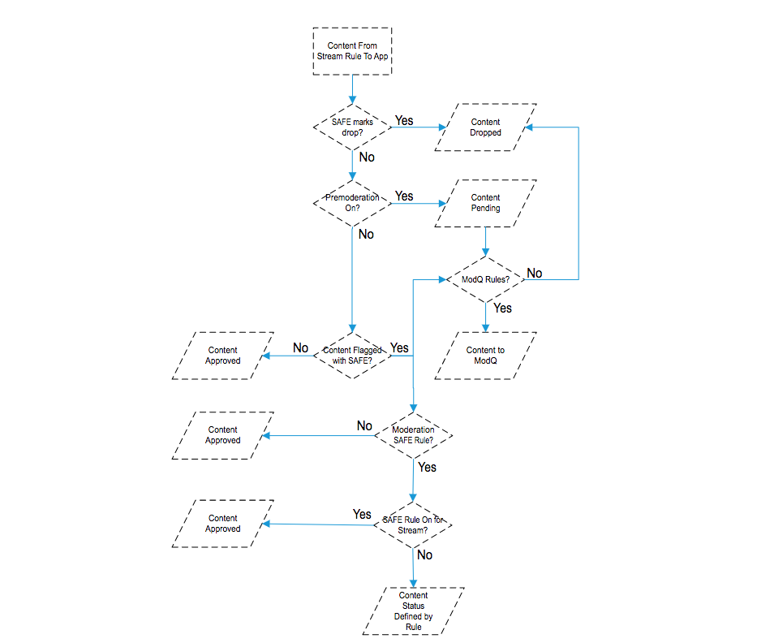
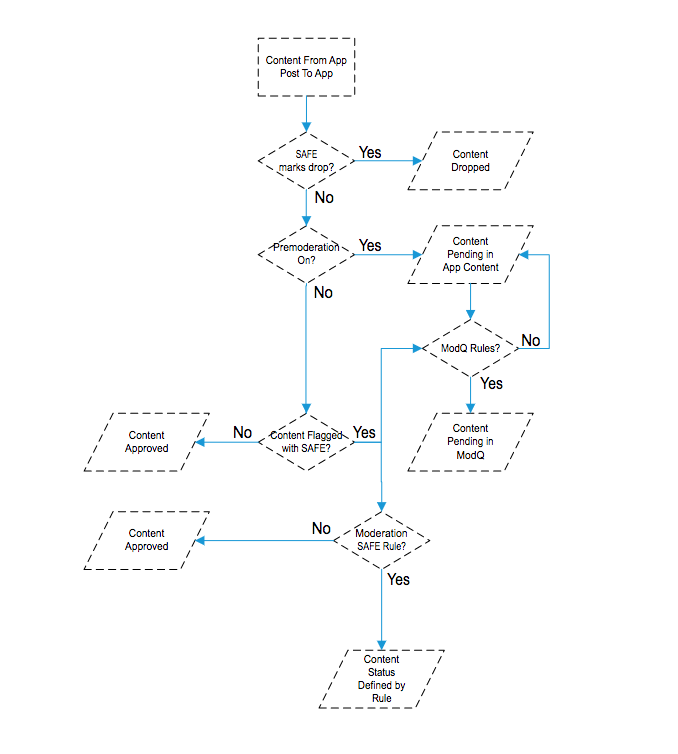
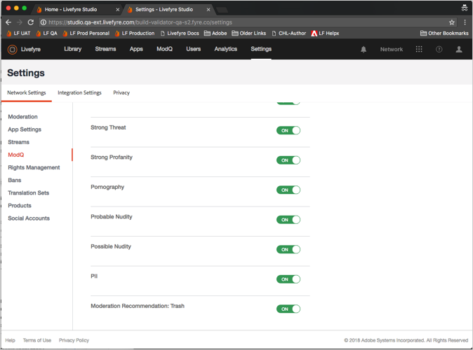
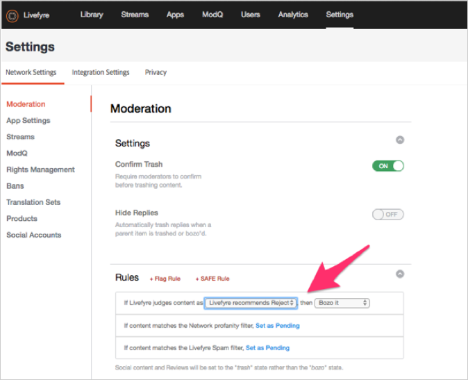

# 중재 설정{#setting-up-moderation}

중재 탭을 사용하여 비속어 목록, 플래그 규칙 및 금지된 IP 주소를 비롯한 수신 컨텐츠에 대한 사전 중재 규칙을 설정할 수 있습니다.

## 중재 작동 방식 {#section_kyf_gvc_t1b}

다음과 같은 방법으로 컨텐츠를 중재할 수 있습니다.

* 컨텐츠를 게시하기 전에 설정한 규칙에 따라 불필요한 컨텐츠를 필터링하도록 컨텐츠를 자동으로 사전 중재합니다.
* 라이브러리의 ModQ 또는 앱 콘텐츠를 사용하여 자동 사전 조정을 사용하여 플래그가 지정된 컨텐츠를 수동으로 삭제하거나 승인합니다.
* 특정 Livefyre 사용자, 소셜 사용자 또는 IP 주소를 금지하여 불쾌한 컨텐츠를 반복적으로 게시하여 게시하지 못하도록 하는 사이트 방문자를 식별합니다.
* 사용자를 허용하거나 특정 스트림, 사이트 또는 네트워크에 대한 필터를 비활성화하여 항상 표시할 수 있는 사람과 컨텐츠를 식별합니다.

다음과 같은 방법으로 컨텐츠를 자동으로 사전 중재할 수 있습니다.

* 특정 유형의 컨텐츠에 자동으로 플래그를 지정하도록 규칙을 설정합니다.

   * 사이트 방문자 플래그로 플래그가 지정된 컨텐츠에 대한 플래그 규칙을 **[!UICONTROL Settings > Moderation > Rules]**
   * 다음을 사용하여 SAFE 규칙 설정 **[!UICONTROL Settings > Moderation > Rules]**
   * 특정 Twitter 사용자를 **[!UICONTROL Settings > Streams]**
   * IP 주소 사용 금지 **[!UICONTROL Settings > Bans]**
   * 요청별로 국가 코드별로 IP 영역을 금지합니다. 금지된 컨텐츠는 스팸으로 표시됩니다.

* 네트워크 또는 사이트의 비속어 목록에서 비속이라고 간주하는 단어 목록 **[!UICONTROL Settings > Moderation > Rules]** 을 만듭니다.
* 특정 스트림, 사이트 또는 네트워크에 대한 필터를 사용하거나 해제하여 사용자 허용(이러한 사용자의 컨텐츠가 항상 표시 허용)을 표시합니다.

비속어 목록, SAFE 필터 및 규칙을 설정한 후 컨텐츠를 미리 중재할지 여부를 선택하고 스트림에서 SAFE 필터를 적용할지 여부를 선택할 수 있습니다. 자세한 내용은 모든 스트림 규칙에 [대한 스트림 규칙 옵션을 참조하십시오](/help/using/c-streams/c-stream-rule-options-for-all-stream-rules.md#c_stream_rule_options_for_all_stream_rules).

Livefyre는 컨텐츠 **[!UICONTROL Approved]**&#x200B;를, **[!UICONTROL Pending]****[!UICONTROL Junk]**&#x200B;등으로 표시합니다. 컨텐츠의 출처, 게시 위치 및 시스템에서 설정한 규칙에 따라. 다음 표에서는 이러한 요인에 따라 Livefyre가 수행하는 작업에 대해 자세히 설명합니다.

## 중재 작동 방식

| 컨텐츠 출처: | 컨텐츠 전송 대상: | 승인 상태 |
|--- |--- |--- |
| 라이브러리 | 앱 | 승인된 컨텐츠 |
| 소셜 검색 | 앱 | 승인된 컨텐츠 |
| 스트림 규칙 | 앱 | 컨텐츠가 [안전]으로 [정크 메일]로 표시됩니까?  <ul><li>아니요 - 스트림-앱 중재 워크플로우</li><li>예 - 컨텐츠 해시됨</li></ul> |
| 라이브러리 | 폴더 | 상태 없음(폴더에, 게시되지 않음, 해시되지 않음) |
| 소셜 검색 | 폴더 | 상태 없음(폴더에, 게시되지 않음, 해시되지 않음) |
| 스트림 규칙 | 폴더 | 컨텐츠가 [안전]으로 [정크 메일]로 표시됩니까?  <ul><li>아니요 - 상태 없음(폴더에, 게시되지 않음, 해시되지 않음)</li><li>예 - 컨텐츠 해시됨</li></ul> |
| 앱 게시물 | 앱 | 컨텐츠가 [안전]으로 [정크 메일]로 표시됩니까?  <ul><li>아니요 - 앱 간 중재 워크플로우</li><li>예 - 컨텐츠 해시됨</li></ul> |

## 스트림-앱 중재 워크플로우 {#section_z5z_w4d_t1b}

스트림의 콘텐츠가 앱에 게시되기 전에 Livefyre는 다음 검사를 수행하여 콘텐츠로 수행할 작업을 결정합니다.

1. SAFE가 컨텐츠를 정크 또는 드롭으로 플래그를 지정하는 경우 Livefyre가 컨텐츠를 트래시합니다.
1. SAFE가 컨텐츠에 고장으로 플래그를 지정하지 않는 경우 Livefyre가 사전 중재가 켜져 있는지 확인합니다.
1. 사전 중재를 사용하는 경우 Livefyre는 컨텐츠를 보류 중으로 표시합니다.
1. ModQ 규칙을 설정하면 Livefyre가 해당 컨텐츠를 ModQ로 보냅니다.
1. 사전 중재를 사용하지 않는 경우 Livefyre는 SAFE가 컨텐츠에 플래그를 지정했는지 확인합니다.
1. SAFE가 컨텐츠에 플래그를 지정한 경우 Livefyre가 컨텐츠를 승인하고 콘텐츠를 앱에 게시합니다.
1. SAFE가 콘텐츠에 플래그를 지정하며 사용자가 SAFE 규칙을 설정하지 않은 경우, Livefyre가 컨텐츠를 승인하고 콘텐츠를 앱에 게시합니다.
1. SAFE가 컨텐츠에 플래그를 지정하고 SAFE 규칙을 설정하는 경우 Livefyre가 스트림에 대해 안전 규칙을 설정했는지 확인합니다.
1. 스트림에 대해 안전 규칙을 설정하는 경우 Livefyre가 콘텐츠를 승인하고 콘텐츠를 앱에 게시합니다. 스트림에 대해 SAFE 규칙을 설정하지 않은 경우 Livefyre는 중재 SAFE 규칙을 사용하여 컨텐츠를 처리하는 방법을 결정합니다(ModQ로 전송, 휴지통 등).

## 앱 간 중재 워크플로우 {#section_fwn_w4d_t1b}

앱 게시물의 콘텐츠가 앱에 게시되기 전에 Livefyre는 다음 검사를 수행하여 콘텐츠로 수행할 작업을 결정합니다.

1. SAFE 필터가 콘텐츠를 드롭으로 플래그를 지정하면 Livefyre가 콘텐츠를 삭제합니다.
1. SAFE가 컨텐츠를 드롭으로 플래그를 지정하지 않는 경우 Livefyre가 사전 중재가 켜져 있는지 확인합니다. 사전 중재를 사용하는 경우 Livefyre는 컨텐츠를 보류 중으로 표시합니다. ModQ 규칙을 설정하면 Livefyre가 ModQ에 보류 중으로 컨텐츠를 보냅니다. 그렇지 않으면 컨텐츠는 라이브러리의 앱 컨텐츠에 보류 중인 상태로 유지됩니다.
1. 사전 중재를 사용하지 않는 경우 Livefyre는 SAFE가 컨텐츠에 플래그를 지정했는지 확인합니다. 그렇지 않은 경우 Livefyre가 콘텐츠를 승인하고 콘텐츠를 앱에 게시합니다.
1. SAFE가 컨텐츠에 플래그를 지정하고 SAFE 규칙을 설정하는 경우 Livefyre는 SAFE 규칙을 사용하여 컨텐츠를 처리하는 방법을 결정합니다(ModQ로 전송, 휴지통 등). SAFE가 콘텐츠에 플래그를 지정하며 사용자가 SAFE 규칙을 설정하지 않은 경우, Livefyre가 컨텐츠를 승인하고 콘텐츠를 앱에 게시합니다.

## 벌크 필터 {#section_lyk_ktx_vy}

벌크 필터는 짧은 기간 내에 모든 Livefyre 네트워크에 게시된 반복적인 컨텐츠를 찾습니다. 감지되면 이 컨텐츠가 벌크로 표시된 다음 기본적으로 해시됩니다. 그러나 벌크 컨텐츠는 사용자가 생성할 수 있습니다(예: &quot;터치다운!&quot;). 인기 축구 경기 중 채팅(Chat)에 반복적으로 게시되는 경우, 대부분 스팸 캠페인에서 비롯됩니다. 이 필터는 언어에 영향을 받지 않으며 모든 언어로 작동합니다. 벌크 필터를 사용자 정의하려면 Livefyre 지원에 문의해야 합니다.

## 규칙 {#section_gqz_ksk_f1b}

규칙 섹션을 사용하여 SAFE 및 사용자 적용된 플래그를 기반으로 사전 중재 규칙을 만듭니다. 이 패널에서는 두 가지 유형의 규칙을 제공합니다.

* **[!UICONTROL Flag Rules:]** 사용자 정의된 횟수로 플래그가 지정된 댓글에 대해 수행할 작업을 지정합니다.
* **[!UICONTROL SAFE Rules:]**SAFE 플래그와 플래그 지정된 컨텐츠에 적용할 동작을 결합합니다.

플래그 규칙을 만들려면 플래그(공격, 주제 해제, 반대 또는 스팸)를 선택하고 컨텐츠 일부에 적용해야 하는 횟수를 입력한 다음 수행할 작업을 선택합니다. 각 플래그 옵션(공격, 주제 해제, 반대 또는 스팸)에 대해 하나의 플래그 규칙을 설정할 수 있습니다.

네트워크, 사이트 및 스트림 수준에서 규칙을 만들 수 있습니다. 사이트 규칙을 다르게 구성하지 않는 한 사이트 수준 규칙은 네트워크 규칙을 상속합니다. 스트림 규칙은 사이트 규칙을 다르게 구성하지 않으면 상속합니다.

사용 가능한 작업:

* **[!UICONTROL Trash it:]**플래그가 달린 댓글을 휴지통으로 보냅니다.
* **[!UICONTROL Bozo it:]** 플래그가 달린 댓글이 계속 표시되는 작성기를 제외한 모든 사용자의 주석을 숨깁니다.
* **[!UICONTROL Pending:]** 컨텐츠를 보류 중으로 설정합니다. 아래에서 Premoderation을 ON으로 설정하면 ModQ **[!UICONTROL Settings > ModQ]**&#x200B;에 있게 됩니다. 그렇지 않으면 앱 콘텐츠에서만 표시됩니다.

>[!NOTE]
>
>Livefyre는 5명의 사용자가 스팸 또는 모욕으로 플래그를 지정한 Bozo 주석에 대한 규칙을 만드는 것이 좋습니다.

## 중재 추천 {#section_ec3_vr3_2cb}

중재 권장 사항을 사용하여 Livefyre 앱에서 사이트 방문자가 게시한 컨텐츠를 중재하는 방법을 결정하는 데 도움을 줄 수 있습니다. 중재 권장 사항 표시기는 이전에 유사한 컨텐츠에서 수행한 작업을 기반으로 컨텐츠 조각을 해시 처리할 가능성이 높은 시기를 권장합니다. 중재 권장 사항을 사용하려면

1. Adobe Livefyre 지원 전문가에 연락하여 중재 추천 기능을 활성화합니다.
1. 네트워크 설정에서 중재 권장 사항을 설정합니다.

   아래 설정을 사용하여 중재 권장 사항을 **[!UICONTROL Livefyre Recommends Trash]** 설정합니다 **[!UICONTROL Network Settings]**.

   

1. 중재 권장 사항이 해시될 가능성이 있는 컨텐츠로 식별하는 컨텐츠로 수행할 작업을 Livefyre에 알려주도록 안전 규칙을 설정합니다. 옵션에 대한 안전 규칙을 설정하는 방법에 대한 자세한 내용은 **[!UICONTROL Livefyre Recommends Trash]** 중재를 [참조하십시오](/help/using/c-features-livefyre/c-about-moderation/c-moderation.md#c_moderation).

   

1. ModQ 또는 앱 콘텐츠 **[!UICONTROL Moderation Recommendation Indicator]** 의 아이콘을 사용하여 중재 권장 사항이 해시될 가능성이 있다고 식별하는 컨텐츠를 필터링합니다.

   ModQ에서 표시기는 다음과 같습니다.  

   중재 권장 사항을 사용하여 ModQ의 컨텐츠를 중재하는 방법에 대한 자세한 내용은 ModQ를 [참조하십시오](/help/using/c-features-livefyre/c-about-moderation/c-modq.md#c_modq).

   앱 컨텐츠에서 중재 권장 사항은 다음과 같습니다.  

   앱 컨텐츠에서 중재 권장 사항을 사용하는 방법에 대한 자세한 내용은 앱 콘텐츠를 [사용하여 콘텐츠 중재를 참조하십시오](/help/using/c-features-livefyre/c-about-moderation/c-moderate-content-using-app-content.md#c_moderate_content_using_app_content).
