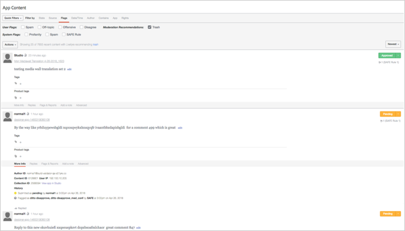

# 중재 설정{#setting-up-moderation}

중재 탭을 사용하여 비속어 목록, 플래그 규칙 및 금지된 IP 주소를 포함한 들어오는 컨텐츠에 대한 중재 규칙을 설정합니다.

## 조정 작동 방식 {#section_kyf_gvc_t1b}

다음과 같은 방법으로 컨텐츠를 중재할 수 있습니다.

* 컨텐츠를 게시하기 전에 설정한 규칙을 기반으로 원하지 않는 컨텐츠를 필터링하기 위해 컨텐츠를 자동으로 미리 중재합니다.
* 라이브러리의 MODQ 또는 앱 콘텐츠를 사용하여 자동 조정을 사용하여 플래그가 지정된 컨텐츠를 수동으로 삭제하거나 승인합니다.
* 특정 Livefyre 사용자, Social 사용자 또는 IP 주소를 금지하여 게시되지 않도록 공격적인 컨텐츠를 반복적으로 게시하는 사이트 방문자를 식별합니다.
* 화이트리스트 사용자를 화이트리스트 하거나 특정 스트림, 사이트 또는 네트워크에 대한 필터를 비활성화하여 항상 표시할 수 있는 사람과 컨텐츠를 식별합니다.

다음과 같은 방법으로 컨텐츠를 자동으로 미리 중재할 수 있습니다.

* 특정 유형의 컨텐츠가 자동으로 표시되도록 규칙을 설정합니다.

   * 사이트 방문자가 플래그를 지정하여 플래그가 지정된 컨텐츠에 대한 플래그 규칙을 설정합니다. **[!UICONTROL Settings > Moderation > Rules]**
   * SAFE Rules 설정 **[!UICONTROL Settings > Moderation > Rules]**
   * 특정 Twitter 사용자를 **[!UICONTROL Settings > Streams]**
   * IP 주소 제한 **[!UICONTROL Settings > Bans]**
   * 요청별로 국가 코드별로 IP 지역을 금지합니다. 금지된 콘텐츠는 스팸으로 표시됩니다.

* 네트워크 또는 사이트에 대한 비속어 **[!UICONTROL Settings > Moderation > Rules]** 목록에서 비욕으로 간주되는 단어 목록을 만듭니다.
* 특정 스트림, 사이트 또는 네트워크에 대한 필터를 사용하거나 비활성화하여 허용 목록 사용자 (항상 이러한 사용자의 컨텐츠를 표시할 수 있음) 를 표시할 수 있습니다.

비속어 목록, 안전한 필터 및 규칙을 설정한 후에는 컨텐츠를 미리 중재하고 스트림에 안전 필터를 적용할지 여부를 선택할 수 있습니다. 자세한 내용은 모든 스트림 규칙에 [대한 스트림 규칙 옵션을 참조하십시오](/help/using/c-streams/c-stream-rule-options-for-all-stream-rules.md#c_stream_rule_options_for_all_stream_rules).

Livefyre는 컨텐츠를 **[!UICONTROL Approved]****[!UICONTROL Pending]**, **[!UICONTROL Junk]**등으로 표시 컨텐츠가 어디에서 오는지, 어디에서 게시될지와 시스템에 설정한 규칙에 따라 달라집니다. 다음 표에서는 이러한 요인에 따라 Livefyre가 수행하는 작업에 대해 자세히 설명합니다.

## 조정 작동 방식

| 컨텐츠 제공 위치: | 콘텐트 보내기: | 승인 상태 |
|--- |--- |--- |
| 라이브러리 | 앱 | 컨텐츠 승인됨 |
| 소셜 검색 | 앱 | 컨텐츠 승인됨 |
| 스트림 규칙 | 앱 | 컨텐츠가 안전 필터로 정크 표시로 표시됩니까?  <ul><li>아니요 - 스트림-앱 중재 워크플로우</li><li>예 - 콘텐츠 트렌드</li></ul> |
| 라이브러리 | 폴더 | 상태 없음 (폴더에서 추적되지 않고 추적되지 않음) |
| 소셜 검색 | 폴더 | 상태 없음 (폴더에서 추적되지 않고 추적되지 않음) |
| 스트림 규칙 | 폴더 | 컨텐츠가 안전 필터로 정크 표시로 표시됩니까?  <ul><li>NO - NO STATUS (IN FOLDER, NOT PUBLISHED, NOT TRASHED)</li><li>예 - 콘텐츠 트렌드</li></ul> |
| 앱 게시물 | 앱 | 컨텐츠가 안전 필터로 정크 표시로 표시됩니까?  <ul><li>아니요 - 앱 간 중재 워크플로우</li><li>예 - 콘텐츠 트렌드</li></ul> |

## 스트림-앱 중재 워크플로우 {#section_z5z_w4d_t1b}

스트림의 컨텐츠가 앱에 게시되기 전에 Livefyre는 다음 검사를 수행하여 컨텐츠를 어떻게 할지 결정합니다.

1. 안전 플래그가 컨텐츠를 정크 또는 드롭으로 플래깅하는 경우 Livefyre는 컨텐츠를 추적합니다.
1. SAFE가 컨텐츠에 정크 플래그를 지정하지 않은 경우 Livefyre는 조정이 켜져 있는지 확인합니다.
1. 중재가 켜져 있는 경우 Livefyre는 컨텐츠를 보류 중으로 표시합니다.
1. MODQ 규칙을 설정하면 Livefyre가 컨텐츠를 MODQ로 보냅니다.
1. Premoderation 이 켜져 있지 않으면 Livefyre는 컨텐츠가 안전하게 플래그가 지정되었는지 확인합니다.
1. 안전 플래그가 지정되면 Livefyre는 콘텐츠를 승인하고 콘텐츠를 앱에 게시합니다.
1. 안전 플래그를 지정하면 보안 규칙을 설정하지 않은 경우 Livefyre는 콘텐츠를 승인하고 콘텐츠를 앱에 게시합니다.
1. 안전 플래그를 지정하고 안전 규칙을 설정한 경우, Livefyre는 스트림에 대한 안전 규칙을 설정했는지 확인합니다.
1. 스트림에 대한 안전 규칙을 설정할 경우 Livefyre는 콘텐츠를 승인하고 콘텐츠를 앱에 게시합니다. 스트림에 대한 안전 규칙을 설정하지 않은 경우 Livefyre는 중재 안전 규칙을 사용하여 컨텐츠 처리 방법 (MODQ, 휴지통 등) 를 결정합니다.

## 앱 간 중재 워크플로우 {#section_fwn_w4d_t1b}

앱 게시물의 컨텐츠가 앱에 게시되기 전에 Livefyre는 다음 검사를 수행하여 콘텐츠를 어떻게 할지 결정합니다.

1. 안전 필터가 컨텐츠에 드롭로 플래그를 지정하면 Livefyre가 컨텐츠를 드롭합니다.
1. SAFE가 컨텐츠에 드롭으로 플래그를 지정하지 않으면 Livefyre는 조정이 켜져 있는지 확인합니다. 중재가 켜져 있는 경우 Livefyre는 컨텐츠를 보류 중으로 표시합니다. MODQ 규칙을 설정하면 Livefyre가 컨텐츠를 MODQ에 대기 중으로 보냅니다. 그렇지 않으면 라이브러리의 앱 컨텐츠에서 컨텐츠가 보류 중인 상태로 유지됩니다.
1. Premoderation 이 켜져 있지 않으면 Livefyre는 컨텐츠가 안전하게 플래그가 지정되었는지 확인합니다. 그렇지 않은 경우 Livefyre는 콘텐츠를 승인하고 콘텐츠를 앱에 게시합니다.
1. 안전 플래그를 지정하고 안전 규칙을 설정한 경우 Livefyre는 SAFE 규칙을 사용하여 컨텐츠 처리 방법 (MODQ, 휴지통 등) 를 결정합니다. 안전 플래그를 지정하면 보안 규칙을 설정하지 않은 경우 Livefyre는 콘텐츠를 승인하고 콘텐츠를 앱에 게시합니다.

## 벌크 필터 {#section_lyk_ktx_vy}

벌크 필터는 짧은 기간 내에 모든 Livefyre 네트워크에 게시된 반복적인 컨텐츠를 찾습니다. 감지되면 이 컨텐츠가 일괄 표시로 플래그로 지정되고 기본적으로 채워집니다. Bulk content may be user-generated (such as «touchdown! » 인기 있는 축구 경기 중 반복적으로 게시됨), 대부분 스팸 캠페인으로 제작된 것입니다. 이 필터는 언어와 독립적이며 모든 언어로 작동합니다. 벌크 필터를 사용자 정의하려면 Livefyre 지원에 문의해야 합니다.

## 규칙 {#section_gqz_ksk_f1b}

규칙 섹션을 사용하여 보호 및 사용자가 적용한 플래그를 기반으로 중재 규칙을 만듭니다. 이 패널에서는 두 가지 유형의 규칙을 제공합니다.

* **[!UICONTROL Flag Rules:]** 정의된 횟수만큼 사용자가 플래그를 지정한 댓글에 수행해야 하는 작업을 지정합니다.
* ****[!UICONTROL SAFE Rules:]플래그가 지정된 컨텐츠를 취하는 동작과 안전한 플래그를 결합합니다.

플래그 규칙을 만들려면 플래그 (불쾌함, 주제 해제, 반대 또는 스팸) 를 선택하고 컨텐츠 일부에 적용해야 하는 횟수를 입력한 다음 취할 작업을 선택합니다. 각 플래그 옵션 (모욕적, 꺼짐, 반대 또는 스팸) 에 대해 하나의 플래그 규칙을 설정할 수 있습니다.

네트워크, 사이트 및 스트림 수준에서 규칙을 만들 수 있습니다. 사이트 규칙을 다르게 구성하지 않으면 사이트 수준 규칙이 네트워크 규칙을 상속합니다. 스트림 규칙은 사용자가 다르게 구성하지 않는 한 사이트 규칙을 상속합니다.

사용 가능한 작업:

* ****[!UICONTROL Trash it:]플래그가 달린 댓글을 휴지통에 보냅니다.
* **[!UICONTROL Bozo it:]** 플래그가 지정된 주석을 제외한 모든 사용자가 볼 수 있는 상태로 숨겨진 주석을 숨깁니다.
* **[!UICONTROL Pending:]** 컨텐츠를 대기 중으로 설정합니다. 중재를 **[!UICONTROL Settings > ModQ]**켬으로 설정하면 MODQ에 있게 됩니다. 그렇지 않으면 앱 컨텐츠에만 적용됩니다.

>[!NOTE]
>
>Livefyre는 5 명의 사용자가 스팸이나 모욕으로 나타내는 보고용 규칙을 만드는 것을 권장합니다.

## 중재 권장 사항 {#section_ec3_vr3_2cb}

중재 권장 사항을 사용하여 Livefyre 앱에서 사이트 방문자가 게시한 컨텐츠를 중재하는 방법을 결정할 수 있습니다. 중재 권장 사항 표시기는 유사한 컨텐츠에서 이전에 수행한 작업을 기준으로 컨텐츠 조각을 트라우트할 가능성이 있는 시기를 추천합니다. 중재 권장 사항을 사용하려면:

1. Adobe Livefyre 지원 전문가에게 연락하여 중재 Recommendations 기능을 켭니다.
1. 네트워크 설정에서 중재 권장 사항을 설정합니다.

   설정을 사용하여 중재 권장 사항을 **[!UICONTROL Livefyre Recommends Trash]** 설정합니다 **[!UICONTROL Network Settings]**.

   

1. 중재 권장 사항이 트랩될 가능성이 있는 컨텐츠로 식별되는 컨텐츠로 어떻게 해야 할지 Livefyre에게 알리는 안전 규칙을 설정합니다. 옵션에 대한 안전 규칙을 설정하는 방법에 대한 자세한 내용은 **[!UICONTROL Livefyre Recommends Trash]**[중재를 참조하십시오](/help/using/c-features-livefyre/c-about-moderation/c-moderation.md#c_moderation).

   

1. MODQ 또는 앱 **[!UICONTROL Moderation Recommendation Indicator]** 컨텐츠에서를 사용하여 중재 권장 사항이 트렌드될 것으로 인식하는 컨텐츠를 필터링합니다.

   MODQ에서 표시기는 다음과 같이 표시됩니다. 

   중재 권장 사항을 사용하여 MODQ에서 컨텐츠를 중재하는 방법에 대한 자세한 내용은 [MODQ](/help/using/c-features-livefyre/c-about-moderation/c-modq.md#c_modq)를 참조하십시오.

   앱 컨텐츠에서 중재 권장 사항은 다음과 같습니다. 

   앱 컨텐츠에서 중재 권장 사항을 사용하는 방법에 대한 자세한 내용은 앱 콘텐츠를 사용하여 컨텐츠 [조정을 참조하십시오](/help/using/c-features-livefyre/c-about-moderation/c-moderate-content-using-app-content.md#c_moderate_content_using_app_content).
