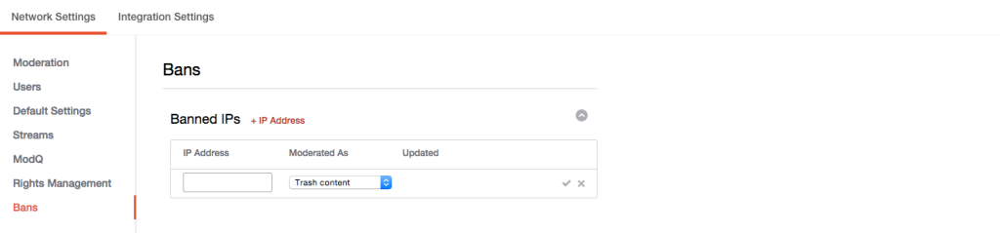

# IP 주소 금지{#ban-ip-addresses}

악의적인 사용자가 동일한 IP 주소에서 여러 계정을 만든 경우 IP 주소를 금지할 수 있습니다.

금지된 사용자가 자신의 의견을 볼 수 없다는 사실을 깨닫기 시작하는 경우, 다른 사용자 이름과 아바타를 사용하여 새로운 사용자 계정을 만들고, 이 금지되지 않은 새로운 계정에서 부적절한 스팸 댓글을 게시하기 시작할 수 있습니다. 중재자는 컨텐츠를 동일한 사용자로 인식하고 이러한 가정을 검증하려면 [계정 세부 사항] 페이지에서 댓글을 게시한 사용자의 IP 주소를 확인합니다.

1. 금지된 IP **[!UICONTROL + IP Address]** 패널에서 을 클릭합니다.
1. 필드에 IP 주소를 입력합니다. IP 주소 범위를 금지하려면 "192.168.0.1 - 192.168.0.10" 형식(IP 주소를 공백으로 구분하고 대시를 따옴표로 묶음)으로 범위를 입력하고 **[!UICONTROL Save]**&#x200B;클릭합니다.
1. 풀다운 메뉴(휴지통, 사전 중재 또는 보조 컨텐트)에서 작업을 선택합니다.
1. 체크 표시를 클릭하여 저장합니다.
