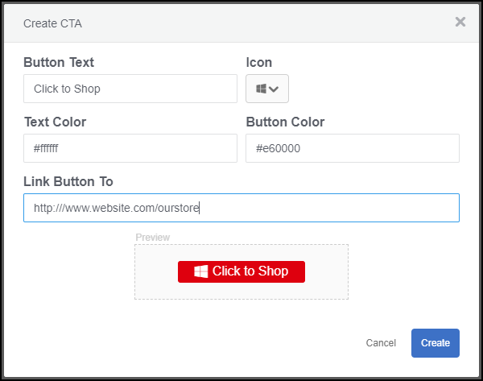
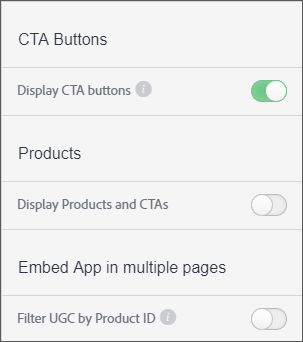

# 사용자 지정 클릭유도문안 단추{#custom-call-to-action-button}

## 사용자 지정 클릭유도문안 단추 {#topic_EBE23A0F827645E0A0C619DCF3872EE5}

사용자 정의 클릭유도문안 (CTA) 단추는 Livefyre 스튜디오의 자산에 추가할 수 있는 단추입니다. 소셜 미디어 페이지 또는 장바구니와 같은 사용자 지정된 URL에 최종 사용자를 참조할 수 있습니다. CTA 버튼은 Livefyre의 여러 위치에서 만들 수 있지만 Livefyre Studio **[!UICONTROL Settings]** 의 섹션 내에서 관리됩니다.

사용자 정의 CTA를 사용하여 다음을 수행할 수 있습니다.

* Livefyre 미디어 벽, Mosaics, Carousel, Film Strip 및 개별 기능 카드에 있는 UGC에 사용자 정의 CTA 버튼을 추가할 수 있습니다.
* 각 UGC 부분에 메시지, 아이콘, 색상, 링크 및 버튼 수를 제어할 수 있습니다.
* 설정 및 라이브러리에서 맞춤형 CTA 버튼을 생성, 관리 및 재활용할 수 있습니다.
* Adobe Analytics를 사용하여 클릭률 측정

## 사용자 지정 클릭유도문안 단추 만들기 {#task_C61B4A8E66F24AC19C833612E596B736}

작업 컨텍스트

1. Livefyre Studio **[!UICONTROL Settings]** 에서를 클릭합니다.
1. 왼쪽 레일에서 **[!UICONTROL CTAs]** 를 클릭합니다.

   CTA 라이브러리가 나타납니다. 이 라이브러리는 폴더 내에서 CTA를 만들고 구성할 수 있습니다. 1. **[!UICONTROL Create CTA]** 을 클릭합니다.
1. 원하는 사용자 정의 설정으로 필드를 채우면 CTA 작성 화면 하단에 단추 미리 보기가 렌더링됩니다.

   

1. **[!UICONTROL Create]** 을 클릭합니다.

   이제 CTA 단추를 자산에 추가할 수 있습니다.

## 자산에 사용자 지정 클릭유도문안 단추 추가 {#task_36190DD1C8204C7793CB7EEA379C2155}

Livefyre Studio의 모든 컨텐츠에 CTA 버튼을 추가할 수 있습니다.

1. Livefyre Studio에서 **[!UICONTROL Library]** > **[!UICONTROL All Assets]** 로 이동합니다.
1. CTA 단추를 추가할 하나 이상의 자산에서 선택합니다.
1. **[!UICONTROL CTAs]** 을 클릭합니다.

   

1. 목록에서 원하는 CTA 단추를 선택한 다음을 클릭합니다 **[!UICONTROL Add]**.

   이제 CTA 단추가 선택한 자산에 표시됩니다.

   >[!NOTE]
   >
   >사용자 지정 CTA가 각 자산에 연결하여 앱에 표시하려면 앱 설정에서 CTA 단추를 활성화해야 합니다.
   >
   >
