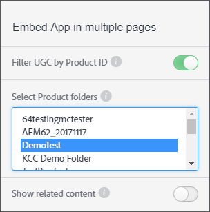

# 제품 ID로 UGC 필터링 {#filter-ugc-product-id}

제품 ID로 UGC를 필터링하면 동일한 앱을 여러 페이지에 포함할 수 있고 각 페이지에 대한 제품별 UGC를 다르게 표시할 수 있습니다.

제품 ID로 UGC를 필터링하려면 다음 단계를 수행하십시오.

1. Livefyre Studio에서 **[!UICONTROL Apps]** 탭으로 이동합니다.

1. 수정할 앱을 선택합니다.

1. 왼쪽 레일에서 디자이너 탭을 선택합니다.

1. 활성화 **[!UICONTROL Filter UGC by Product ID]**.



1. UGC를 필터링할 제품 또는 제품이 들어 있는 최상위 제품 폴더를 선택합니다.
CTRL/Command 키를 누른 상태로 여러 폴더를 선택합니다.

1. **[!UICONTROL Show related content]**비활성화.
활성화되면 `data-lf-attr-product` 속성을 사용하여 필터링된 컨텐츠가 먼저 표시되고 앱의 다른 모든 컨텐츠가 먼저 표시됩니다.

1. **[!UICONTROL Publish]**을 클릭합니다.

1. 결과 코드에 필터링할 제품 ID를 삽입합니다.

>[!NOTE]
>
>제품 ID를 찾으려면 **[!UICONTROL Settings > Products]**으로 이동합니다. 원하는 제품을 찾아 선택하면 ID가 표시됩니다.

예를 들어 다음 코드가 미디어 담벼락 앱에 대해 생성됩니다.

```
<script type="text/javascript" src="https://cdn.livefyre.com/
Livefyre.js"></script><div class="lf-app-embed" data-lfapp="
59dc41fa-85a5-49ed-8d60-d74616b3ccd1/tagged/published" datalf-
env="prod" data-lf-read-only="" data-lf-attr-product="<product
 1>,<product 2>"></div><script>Livefyre.require(["app-embed#1.0.11"],
 function (appEmbed) {appEmbed.loadAll().done(function(embed)
 {embed = embed[0];if (embed.el.onload && embed.getConfig)
 {embed.el.onload(embed.getConfig());}});});</script>
```

제품에 태그를 지정하려면 `<product 1>``data-lf-attr-product` 속성에서 원하는 제품 ID로 바꿉니다. 쉼표로 구분된 제품 ID를 추가로 추가하여 한 제품 이상을 태그로 지정할 수 있습니다. 제품은 5 단계에서 선택한 최상위 제품 폴더 내에 포함되어야 합니다.

수정된 코드 세그먼트는 다음과 같이 나타납니다.

```
<script type="text/javascript" src="https://cdn.livefyre.com/
Livefyre.js"></script><div class="lf-app-embed" data-lfapp="
59dc41fa-85a5-49ed-8d60-d74616b3ccd1/tagged/published"
 data-lf-env="prod" data-lf-read-only="" data-lf-attrproduct="
109,47"></div><script>Livefyre.require(["app-embed#1.0.11"],
 function (appEmbed) {appEmbed.loadAll().done(function(embed)
 {embed = embed[0];if (embed.el.onload && embed.getConfig)
 {embed.el.onload(embed.getConfig());}});});</script>
```

이제 앱은 태그 지정된 제품 ID만 표시합니다.