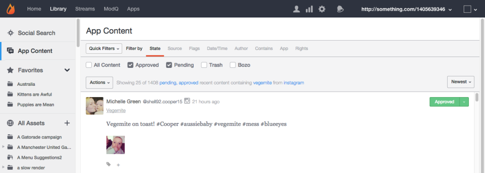
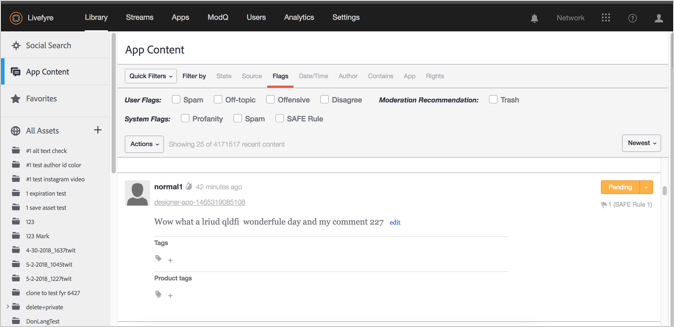
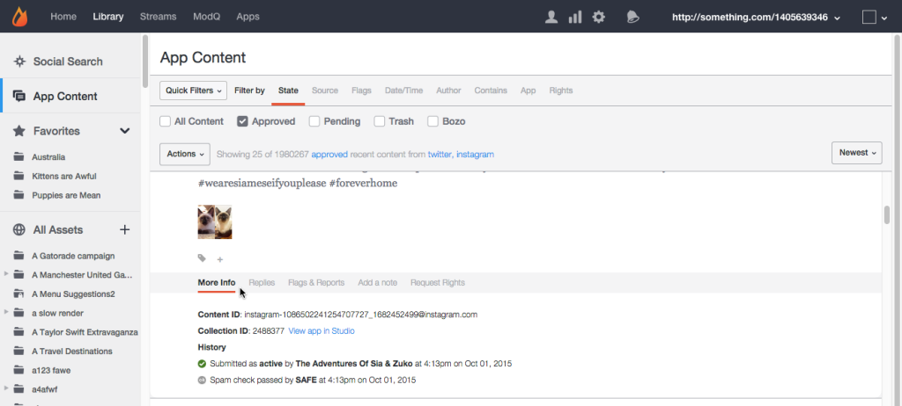
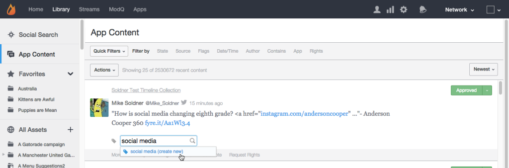

# 앱 콘텐츠 탭{#app-content-tab}

Livefyre 네트워크에서 콘텐츠 관리

라이브러리의 앱 콘텐츠 탭에서 앱 전체에 게시된 콘텐츠를 검색하고 중재할 수 있습니다. **[!UICONTROL App Content]** 이 탭에서 와일드카드 검색을 사용하여 여러 검색 필터를 사용할 수 있으므로 검색 매개 변수를 보다 빠르고 쉽게 정의할 수 있습니다.

앱 콘텐츠 탭을 사용하여 다음을 수행할 수 있습니다.

* 컨텐츠 검색
* 콘텐트 내역 보기
* 컨텐츠 중재
* 태그 추가
* 기능 컨텐츠
* 제품 카탈로그의 제품과 컨텐츠 연결

앱 콘텐츠 탭을 사용하여 콘텐츠를 중재하는 방법에 대한 자세한 내용은 을 참조하십시오.

## 와일드카드 검색 {#section_jvr_ntm_zz}

Livefyre 검색 필드는 와일드카드를 지원하므로 부분 (또는 단어 조각) 에 별표 (*) 를 추가하여 부분 일치를 포착할 수 있습니다.

예를 들면 다음과 같습니다.

* Ball returned only ball
* Ball * 공 및 풍선 반환
* * Ball Ball Returns Ball and Football
* * Ball * Ball and Uniball and Snow Balled

## 컨텐츠 검색 {#section_fw1_mtm_zz}

앱 콘텐츠 패널에서는 다양한 컨텐츠 필터링 옵션을 사용하여 검색 범위를 좁힐 수 있습니다.

**[!UICONTROL Quick Filters]** 풀다운을 사용하여 반환된 컨텐츠를 **[!UICONTROL All Content]****[!UICONTROL All Sidenotes]****[!UICONTROL Approved]****[!UICONTROL Approved & Flagged]**, **[!UICONTROL Pending]****[!UICONTROL Rights Requests]** 또는 상태와 같이 좁힙니다. 그런 다음 **[!UICONTROL Filter by]** 옵션을 선택하고 확인란 또는 입력 필드를 사용하여 검색 범위를 좁힐 수 있습니다.

풀다운 메뉴를 사용하여 목록의 **[!UICONTROL Newest]**컨텐츠를 **[!UICONTROL Oldest]**, **[!UICONTROL Recently updated]****[!UICONTROL Most flags]** 또는 **[!UICONTROL Most liked]**별로 정렬합니다.

## 필터링 기준 옵션 {#section_aqn_xqm_zz}

**[!UICONTROL Filter by]** 막대를 사용하여 다음 옵션을 기준으로 필터링합니다.

* **상태를** 사용하면 컨텐츠의 현재 중재 상태별로 필터링할 수 있습니다. ** [!UICONTROL All Content]** **[!UICONTROL Approved]**, **[!UICONTROL Pending]**또는 **[!UICONTROL Bozo]**.

* **소스를** 사용하면 컨텐츠 소스를 기준으로 필터링할 수 있습니다. 스트림에 직접 게시된 사용자 생성 컨텐트를 **[!UICONTROL Livefyre]** 나열하려면 선택합니다. 해당 소스에서 **[!UICONTROL Facebook]****[!UICONTROL Twitter]****[!UICONTROL RSS]** 앱에 가져온 콘텐츠를 선택하거나 포함할 수 있습니다.

* **플래그를 선택하는 플래그를** 사용하면 (스팸, **[!UICONTROL User Flags]** 꺼짐, 모욕적 또는 반대), 안전 (모독, **[!UICONTROL System Flags]** 스팸 또는 마법과 같은 중재) 를 기준으로 필터링하거나 **[!UICONTROL Moderation Recommendations]**, 또는, 

* **날짜/시간을** 사용하면 컨텐츠가 원래 **[!UICONTROL Created]** (또는 Socialsync 또는 스트림을 통해 앱에 가져오기) 또는 마지막으로 **[!UICONTROL Modified]** (편집됨, 플래그 지정됨 또는 상태가 변경됨) 일 때까지 표시됩니다.

* **작성자는** 작성자 **[!UICONTROL IP]** 주소 (사용자 패널이나 **[!UICONTROL Display Name]** 작성자가 게시한 컨텐츠 위) 또는 **[!UICONTROL User ID]**(사용자 패널에 있음) 로 필터링할 수 있습니다.

* **Contains you** to filter the most recent 90 days of content by **[!UICONTROL Keyword]** or **[!UICONTROL Content Tag]**. 미디어가 포함된 컨텐츠만 반환하는 **[!UICONTROL Media]** 확인란을 선택합니다. 모든 컨텐츠를 검색하려면 목록의 모든 컨텐츠를 아래로 스크롤한 다음을 클릭합니다 **[!UICONTROL Search full data]**.

   **참고:** 여러 키워드 및 컨텐츠 태그 검색이 지원되지 않습니다. 여러 키워드 또는 태그를 입력하면 마지막 단어가 검색에 사용됩니다.

   컨텐츠 태그로 검색할 때 검색 필드에 입력하면 제안 태그가 자동으로 채워집니다. 검색 결과는 태그가 지정된 모든 컨텐츠를 반환합니다. (이 필드를 사용하여 특별 컨텐츠를 검색하거나, Studio의 주요 컨텐츠에서 **[!UICONTROL Featured]** 레이블을 클릭합니다.)

   **참고:** 태그 이름 앞에 빼기 (-) 기호를 사용하여 해당 태그를 포함하지 않는 컨텐츠를 검색합니다. 예를 들면 다음과 같습니다. '-miley'를 검색하여'miley'태그가 포함되지 않은 모든 콘텐츠를 검색합니다.

* **앱을** 사용하면 **[!UICONTROL Collection ID]**, **[!UICONTROL App Tag]**또는 **상위 ID**로 필터링할 수 있습니다. 상위 ID로 필터링하면 입력 컨텐츠 ID에 대한 답글인 모든 컨텐츠가 반환됩니다. (태그를 쉼표로 구분하여 입력하여 여러 태그로 필터링합니다.)

* **권한을 사용하면** 권한 요청 상태별로 필터링할 수 있습니다. ** [!UICONTROL Requested]** **[!UICONTROL Granted]**, **[!UICONTROL Replied]**또는 **[!UICONTROL Expired]**.

## Bozo 콘텐츠 {#section_afl_vqm_zz}

앱에서 **[!UICONTROL Bozo]** 컨텐츠는 컨텐츠 작성자에게만 표시됩니다. 이를 통해 사용자는 다른 모든 사용자 및 중재자로부터 컨텐츠를 숨긴 상태로 컨텐츠를 승인했다고 생각할 수 있습니다.

>[!NOTE]
>
>Socialsync 나 Streams **[!UICONTROL cannot]** 로 발생한 소셜 컨텐츠는 Bozo로 설정됩니다.

다음과 같은 이유로 콘텐츠를 보고할 수 있습니다.

* 보안을 통해 스팸으로 식별된 컨텐츠는 Bozo 상태로 자동 설정됩니다.
* 금지된 사용자의 모든 컨텐츠는 자동으로 Bozo로 설정됩니다.
* Studio에서 Bozo를 표시할 수 있습니다.
* 중재자는 스트림에서 직접 컨텐트를 볼 수 있습니다.

## 콘텐트 내역 보기 {#section_ayz_tqm_zz}

콘텐츠 패널에서는 미리 중재, 스팸 필터링, 게시 날짜, 항목에 할당된 모든 사용자 플래그 또는 메모를 포함하여 나열된 모든 컨텐츠의 내역을 검토할 수 있습니다.

컨텐츠 패널 하단에 있는 탭을 사용하여 작업 내역을 확인합니다.

* **[!UICONTROL More Info:]** 제출, 편집, 스팸 확인, 상태 변경, 노트 등 이 컨텐츠에 대한 모든 활동을 나열합니다. Livefyre 콘텐츠 ID와 사용자의 IP 주소도 이 섹션에 표시됩니다.
* **[!UICONTROL Replies:]** 최대 6 개의 답글을 표시합니다. 게시물에 **[!UICONTROL Show all replies]** 대한 답글을 모두 표시하려면을 클릭합니다.

* **[!UICONTROL Flags & Reports:]** 모든 사용자 플래그, 컨텐트를 플래그를 지정한 사용자의 아바타 및 모든 보고서 (컨텐츠에 플래그를 지정할 때 사용자가 추가한 메모) 를 나열합니다.
* **[!UICONTROL Add a note:]** 다른 관리자나 중재자에게 메모를 추가하여 메모를 추가할 수 있습니다.
* **[!UICONTROL Request Rights:]** 권한 요청이 발생할 수 있는 **[!UICONTROL New Rights Request]** 대화 상자를 엽니다.

* ****[!UICONTROL Save as Asset:]**[!UICONTROL Advanced Options]** 는 선택한 항목을 에셋 라이브러리에 저장하거나, 앱에 게시하거나, 작성자로부터 재사용을 요청할 수 있는 대화 상자를 엽니다.

## 컨텐트에 태그 추가 {#section_xb4_mxr_rdb}

컨텐츠 태깅을 사용하면 컨텐츠를 분류 및 구성하여 손쉽게 검색 및 스타일 지정을 수행하거나 컨텐츠로 표시할 수 있습니다.

태그를 추가하려면 콘텐츠 아래의 더하기 ( **[!UICONTROL +]**) 아이콘을 클릭하면 됩니다. 새 태그를 입력하거나 기존 태그 목록에서 선택합니다.

## 모든 자산에서 이미지 검색 {#section_zxf_hsf_wcb}

라이브러리에 컨텐츠를 추가하면 스마트 태그별로 컨텐츠를 검색할 수 있습니다.

라이브러리에서 모든 자산 아래의 다음을 클릭하여 기존 이미지를 검색할 수 **[!UICONTROL Show Filters]** 있습니다.

* 검색 필드에서 검색할 텍스트 입력
* 연관성별로 정렬
* 스마트 태그로 검색할 **[!UICONTROL Tags]** 필드에 텍스트를 입력합니다. 스마트 태그 등급 알고리즘은 스마트 태그 신뢰 점수, 컨텐츠 새로 만들기 방법 및 사용자가 컨텐츠에 제공한 별 수를 사용하여 컨텐츠를 필터링합니다.

## 주요 컨텐츠 {#section_emb_kqm_zz}

기본 **[!UICONTROL Featured]** 태그를 선택하여 콘텐츠를 주요 요소로 표시하고 사용자에게 중요한 내용으로 강조 표시합니다. 태그가 지정된 후에는 맞춤형 스타일 옵션을 사용하여 앱에서 주요 콘텐츠를 사용자 정의할 수 있습니다.

## 컨텐츠를 기능 또는 기능 취소 {#section_ojx_3qm_zz}

* Studio에서 컨텐츠 부분 옆에 **[!UICONTROL +]** 있는 기호를 클릭하고 드롭다운 목록에서 **[!UICONTROL Featured]** 태그를 선택한 다음을 **[!UICONTROL Enter]** 클릭하여 기능을 선택합니다. 태그가 컨텐츠 옆에 저장되고 표시됩니다.

* 기능을 해제하려면 **[!UICONTROL x]** 컨텐츠 조각에 표시되는 **[!UICONTROL Featured]** 태그를 클릭합니다.

* 댓글, 라이브 블로그 또는 앱 내에서 기능을 가리킨 다음을 클릭합니다 **[!UICONTROL Feature]**. 기능을 해제하려면 콘텐츠를 마우스로 가리킨 **[!UICONTROL Unfeature]**다음을 클릭합니다.

>[!NOTE]
>
>공간 제약으로 인해 채팅 컨텐츠는 Studio를 사용하여 기능되거나 기능별로 기능하지 않을 수 있으며 앱 자체에서 기능별로 기능하지 않을 수 있습니다.

## 주요 컨텐츠 편집 {#section_pyw_hqm_zz}

다음 예외를 제외하고 주요 컨텐츠에 대한 대부분의 일반 작업을 수행할 수 있습니다.

* 주요 콘텐츠는 플래그를 지정할 수 없습니다.
* 사용자는 컨텐츠를 원하는 대로 삭제할 수 있지만 원할 경우 삭제할 수 있습니다. 중재자는 주요 컨텐츠를 편집할 수 있습니다.

