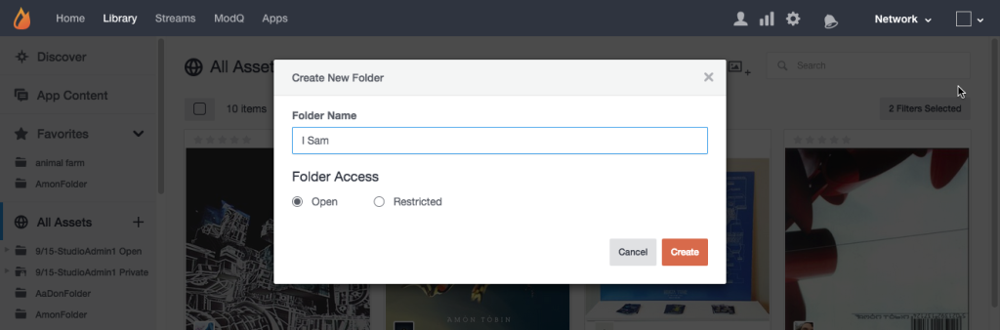

# 자산 폴더 만들기{#create-asset-folders}

폴더를 만들어 자산을 구성합니다.

새 폴더를 만들면 모든 자산 목록에 알파벳 순으로 추가됩니다. 하위 폴더를 추가하려면 먼저 하위 폴더가 위치할 폴더를 선택한 다음 페이지 맨 위에 있는 **[!UICONTROL Create New Subfolder]** 아이콘을 클릭합니다.

1. 트리 **[!UICONTROL Create new folder]** **[!UICONTROL Create]** 보기에서 클릭하고 이름을 입력한 다음 을 클릭하여 모든 자산의 최상위 수준에 폴더를 만듭니다.
1. 폴더를 선택한 다음 페이지 맨 위에 있는 **[!UICONTROL Create New Subfolder]** 아이콘을 클릭하여 하위 폴더를 추가합니다.
1. 대화 상자에서 에셋 라이브러리에 컨텐츠를 추가할 때 새 폴더를 **[!UICONTROL Add to folder > Select folder]** 만듭니다.
