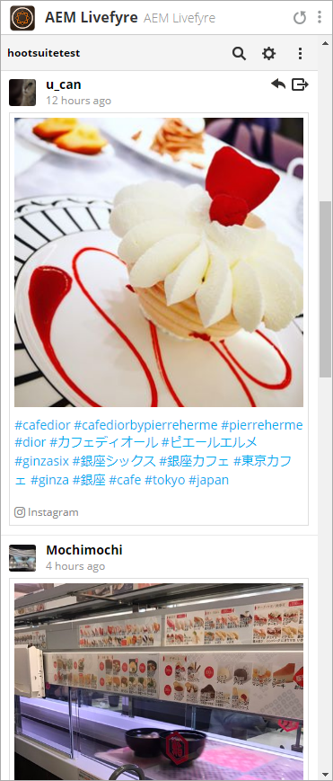

# Hootsuite에서 Adobe Experience Manager Livefyre 사용{#use-adobe-experience-manager-livefyre-with-hootsuite}

Hootsuite에서 Experience Manager Livefyre를 사용하는 방법을 살펴보십시오. Hootsuite 대시보드에서 바로 사용자가 생성한 콘텐츠를 조정하거나 관리 및 공유할 수 있습니다.

## Hootsuite에서 Adobe Experience Manager Livefyre 사용 {#topic_FB6E613DBCF74F39ABD5045C501EA326}

Hootsuite에서 Experience Manager Livefyre를 사용하는 방법을 살펴보십시오. Hootsuite 대시보드에서 바로 사용자가 생성한 콘텐츠를 조정하거나 관리 및 공유할 수 있습니다.

## 시작하기 {#task_22699BD901C24384AB2DC02D926D8F4A}

작업 컨텍스트

1. Hootsuite 앱 디렉토리에서 Hootsuite 용 Adobe Experience Manager Livefyre를 설치합니다.

1. Hootsuite 대시보드에서 Adobe에 **로그인을**클릭합니다.

   

1. Livefyre 자격 증명을 사용하여 Experience Manager Livefyre에 로그인합니다.
1. Hootsuite에 라이브러리에 액세스할 수 있는 권한을 부여하려면 **[승인** ] 를 클릭합니다.

   

   권한이 부여되면 Experience Manager Livefyre 라이브러리에서 에셋을 검색할 수 있는 Hootsuite 대시보드가 다시 표시됩니다.

## 자산 검색 {#task_0B011B0C539E400BB72A6DF69FBF66C0}

작업 컨텍스트

1. 메뉴 막대에서 검색 아이콘을 클릭하여 Experience Manager Livefyre 라이브러리에서 자산을 검색합니다.

   

1. **선택을** 클릭하면 모든 라이브러리와 함께 팝업이 표시됩니다.
1. 라이브러리의 폴더를 클릭한 다음 폴더 **선택을** 클릭하여 Hootsuite 스트림에 표시할 라이브러리를 선택합니다.

   

## 필터링 옵션 {#concept_5D062A9CD61A4B2E90784E5AA31CB16D}

자산, 권한, 키워드 및 태그 섹션 표시를 사용하여 검색 결과를 필터링할 수 있습니다.

필터링 옵션은 다음과 같습니다.

| section | 설명 |
|--- |--- |
| 자산 표시 | 모든 소스 또는 개별 소스에서 자산을 보려면 선택합니다. 예를 들면 다음과 같습니다. Instagram, Twitter, Facebook 등 |
| 권한 | 특정 권한 설정이 있는 자산만 표시하려면 선택합니다. |
| 키워드 | 키워드 또는 태그별로 결과를 필터링하려면 선택합니다. 키워드별 필터링은 게시물의 텍스트 컨텐츠 및 작성자 표시 이름 및 작성자 사용자 이름을 검색합니다. |
| 태그 | 키워드 또는 태그별로 결과를 필터링하려면 선택합니다. 키워드별 필터링은 게시물의 텍스트 컨텐츠 및 작성자 표시 이름 및 작성자 사용자 이름을 검색합니다. |

검색 매개 변수를 선택하면 검색할 때 자산이 인스트림에 표시됩니다.

### 스트림 메뉴 옵션

사용자의 이름이나 아이콘을 클릭하면 해당 네트워크의 사용자가 표시됩니다. 시간을 클릭하면 원본 문서가 표시됩니다. 마우스가 항목 위에 있으면 더 많은 옵션이 나타납니다. 공유 클릭 

아이콘을 클릭하면 현재 자산이 네트워크 구성 상자에 추가되므로 Hootsuite를 통해 네트워크와 공유할 수 있습니다.

>[!NOTE]
>
>[공유] 단추는 권한이 부여된 자산을 필터링하려는 경우에만 나타납니다.

[할당]  아이콘을 클릭하여 현재 항목을 Hootsuite 팀 구성원 중 한 명에게 할당합니다. 항목이 이미 지정된 경우 

아이콘이 나타납니다. 현재 할당을 해결하려면 클릭합니다.

### 기타 앱 메뉴

설정 클릭 

아이콘을 사용하면 현재 Experience Manager Livefyre 계정의 연결을 끊고 다른 계정과 연결할 수 있습니다.

메뉴 클릭 

아이콘은 이 문서, 지원 및 Synaptive의 웹 사이트에 대한 링크를 표시합니다.

## Experience Manager Livefyre App Plugin {#task_33C8CEF4F5E44830B970BB3A7AAA2AA6}

Hootsuite 스트림에 자산 라이브러리를 표시할 수 있을 뿐만 아니라 Instagram, Twitter, Facebook 및 YouTube 스트림의 항목을 Experience Manager Livefyre 라이브러리에 저장할 수도 있습니다.

1. 각 항목 하단에 있는 메뉴 아이콘을 클릭합니다.

   

1. AEM Livefyre로 **전송을 선택합니다**.
1. 자산을 저장할 라이브러리를 하나 이상 선택합니다.

   

1. 라이브러리에 ****저장을 클릭하면 항목이 선택한 라이브러리에 저장됩니다.

## Experience Manager Livefyre 미디어 라이브러리 구성 요소 {#task_9CA2D5D49F8E463F9EF475BC09C8ACC9}

Hootsuite Composer의 미디어 구성 요소를 통해 에셋에 액세스할 수 있습니다.

1. 컴포저의 미디어 섹션에서 **[미디어 라이브러리** **열기] 링크를** 클릭합니다.

   

1. 드롭다운 메뉴에서 Adobe Experience Manager Livefyre를 선택하면 파일이 표시됩니다.

   

1. 쓰는 현재 게시물에 자산을 추가하려면 해당 자산을 클릭합니다. 특정 자산을 검색하려면 **검색 미디어** 상자에 검색어를 입력하면 결과가 표시됩니다.
