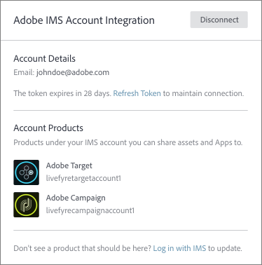
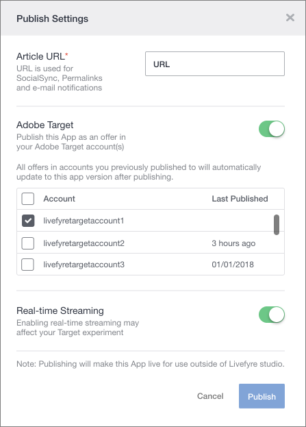

# Adobe Target {#livefyre-target}에 Adobe Experience Manager Livefyre 사용

Livefyre와 Adobe Target의 통합을 통해 Livefyre 앱을 Target 오퍼 라이브러리에 직접 공유할 수 있습니다.

## Target {#connect-livefyre-target}에 Livefyre 인스턴스 연결

사용자 설정에 Adobe IMS 계정을 연결하여 Livefyre 인스턴스를 Adobe Target에 연결합니다.

1. Livefyre 스튜디오에서 **[!UICONTROL Users]** 탭을 클릭합니다.

1. IMS 계정 통합을 통해 Target에 연결할 사용자 계정을 선택합니다.

1. 클릭 **[!UICONTROL Connect]**.

1. IMS 자격 증명을 입력합니다.

Adobe IMS 계정에서 Adobe IMS 통합 창에 표시할 수 있는 액세스 권한이 있는 제품 인스턴스입니다.

이제 Livefyre 인스턴스가 Adobe Target에 연결되어 있습니다.

## Adobe Target {#share-livefyre-target}과 Livefyre 앱 공유

Livefyre 스튜디오에서 만든 앱을 Adobe Target과 직접 공유할 수 있습니다.

1. Livefyre 스튜디오에서 **[!UICONTROL Apps]** 탭을 클릭합니다.

1. Adobe Target에 공유할 앱을 선택합니다.

1. 클릭 **[!UICONTROL Publish]**.

1. 제작 설정에서 Adobe Target 스위치를 클릭합니다.

Target 인스턴스 목록이 나타납니다.

1. 앱을 공유할 Target 인스턴스를 선택합니다.

1. 클릭  **[!UICONTROL Publish]**.

이제 Target 오퍼 라이브러리에서 Livefyre 앱을 사용할 수 있습니다. 앱 게시에 대한 자세한 내용은 Target 설명서의 [콘텐츠 게시](/help/using/c-library/t-publish-content.md) 및 [오퍼](https://docs.adobe.com/content/help/en/target/using/experiences/offers/manage-content.html)를 참조하십시오.
