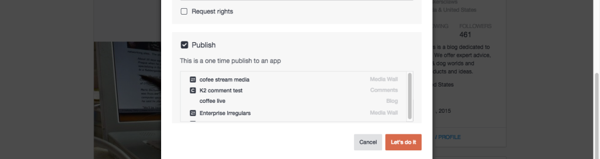

# 컨텐츠 게시{#publish-content}

콘텐츠를 앱에 직접 게시합니다.

앱에 직접 게시된 컨텐츠는 자산 라이브러리에 저장되지 않습니다.

1. **[!UICONTROL View Details]** for an asset.
1. 대화 상자에서 **[!UICONTROL Publish]** 확인란을 **[!UICONTROL Advanced Options]** 선택합니다.
1. 항목을 게시할 앱을 선택합니다.
1. **[!UICONTROL Let’s do it]** 을 클릭합니다.
