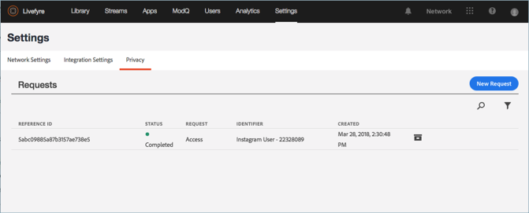
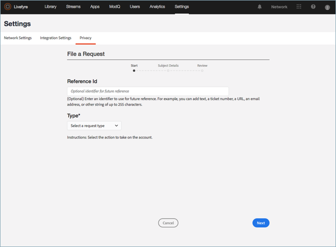
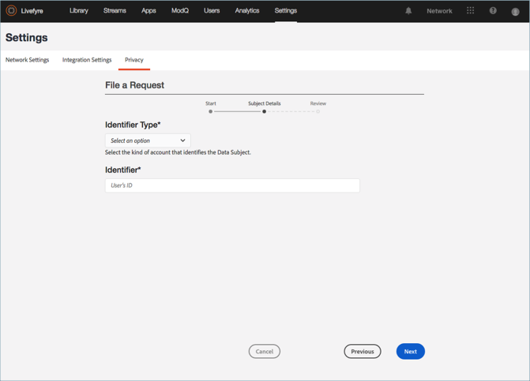
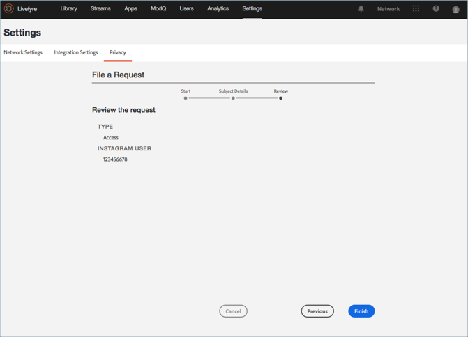

# 개인 정보 요청 만들기{#create-a-privacy-request}

Livefyre에서 개인정보 보호 요청 만들기를 참조하십시오.

사용자에 대한 모든 데이터를 삭제하고, 사용자에 대한 모든 데이터에 대한 보고서를 생성하고, 이 프로세스를 사용하여 옵트인 또는 옵트아웃 변경을 수행합니다.

사용자를 검색하여 찾고 해당 컨텐츠에 대한 보고서를 생성하려면:

1. 이동한 **[!UICONTROL Settings > Privacy]****[!UICONTROL Create Request]**다음을 클릭합니다.

   

1. 창에 있는 정보를 **[!UICONTROL Submit Request]** 채웁니다.

   * **[!UICONTROL Reference Id]**. 나중에 참조할 수 있도록 사용할 식별자를 입력합니다. 예를 들어 텍스트, 티켓 번호, URL, 이메일 주소 또는 최대 255 자까지 입력할 수 있습니다.
   * **[!UICONTROL Type]**

      * **액세스**. 계정과 관련된 사용 가능한 모든 데이터를 수집합니다. 민감한 세부 사항 (예: 암호 또는 소셜 자격 증명) 는 난독화되거나 생략됩니다.

      * ****삭제할 수 있습니다. Celetes 또는 계정과 연관된 모든 데이터를 난독화합니다. **이 옵션을 선택하고 [제출] 를 클릭하면 이 동작을 반전하거나 취소할 수 없으며 삭제된 *데이터를 복구할 수 없습니다.*** 계정이 Livefyre Studio 사용자에게 속해 있는 경우, 비즈니스 기록의 무결성을 유지하기 위해 일부 데이터가 보존됩니다.

         >[!IMPORTANT]
         >
         >계정의 데이터를 삭제하면 계정과 연관된 데이터가 영구적으로 삭제 또는 제거됩니다. 이 작업은 되돌릴 수 없으며 삭제한 후에는 데이터를 복구할 수 없습니다.

      * **Opt-out**. Livefyre가 스트림 또는 소셜 검색을 통해 소셜 계정에서 데이터 또는 컨텐츠를 수동적으로 수집하는 것을 방지합니다. 등록 및 옵트아웃은 등록된 사용자에게 적용되지 않습니다.
      * ****동의. Livefyre가 스트림 또는 소셜 검색을 통해 이전에 옵트아웃한 소셜 계정에서 데이터 또는 컨텐츠를 수동적으로 수집할 수 있게 합니다. 등록 및 옵트아웃은 등록된 사용자에게 적용되지 않습니다.
      

   * **[!UICONTROL Identifier Type]** and **[!UICONTROL Identifier]**

      * **[!UICONTROL User Account]**

         * 사용자 관리 시스템 또는 Livefyre의 Studio 사용자 ID로 생성된 사용자 계정 ID로 등록된 사용자의 계정을 식별합니다. **Livefyre** **사용자 설정에서 사용자에 대한 사용자** 세부 사항이나 **에셋 라이브러리** 또는 **앱 컨텐츠의 세부 정보에 있는 사용자 계정 ID를 찾을 수도 있습니다.**

         * 허용되는 값: 최대 255 자까지 영숫자 문자열을 사용할 수 있습니다. 이메일 주소가 올바른 입력이 아닙니다.
      * **[!UICONTROL Facebook User]**

         * Facebook에서 제공한 숫자 ID로 계정을 식별합니다. 요청자가 이를 제공해야 합니다. 여기에서 숫자 Facebook ID [를 찾는 방법에 대한 지침을 찾을 수 있습니다.](https://www.facebook.com/help/1397933243846983?helpref=faq_content)
         * 허용되는 값: 6-16 숫자 문자
      * **[!UICONTROL Instagram User]**

         * Instagram에서 제공한 숫자 ID로 계정을 식별합니다. 요청자가 이를 제공해야 합니다. 온라인으로 검색하여 Instagram 계정에서 숫자 Instagram ID를 찾는 방법에 대한 지침을 찾을 수 있습니다.
         * 허용되는 값: 5-16 숫자 문자
      * **[!UICONTROL Twitter User]**

         * Twitter에서 제공한 숫자 ID로 계정을 식별합니다. 개인정보 보호를 요청하는 사람이 이를 제공해야 합니다. 온라인으로 검색하여 Twitter 계정에 대한 숫자 Twitter ID를 찾는 방법에 대한 지침을 찾을 수 있습니다.
         * 허용되는 값: 5-16 숫자 문자
      * **[!UICONTROL YouTube User]**

         * YouTube에서 제공한 숫자 ID로 계정을 식별합니다. 개인정보 보호를 요청하는 사람이 이를 제공해야 합니다. YouTube 계정에서 [숫자 YouTube ID를 찾는 방법에 대한 지침을 찾을 수 있습니다.](https://support.google.com/youtube/answer/3250431?hl=en)
         * 허용되는 값: 5-16 숫자 문자
      * **[!UICONTROL Generic Author]**

         * Livefyre 작성자 ID (JID) 로 계정을 식별합니다. RSS, Tumblr 또는 URL를 통해 제공되는 콘텐트에 이 옵션을 사용합니다. 이 ID를 찾으려면 **앱 콘텐츠** 또는 **자산 라이브러리에서**작성자에 귀속된 콘텐츠를 검색한 다음 항목을 선택합니다. ID는 [세부 정보] 섹션의 **[작성자] 아래에 있는** [자산] 라이브러리에서 **[정보** ] 또는 **[자산 라이브러리** ] **에서** **사용할 수** 있습니다.

         * 허용되는 값: 최대 255 자까지 영숫자 문자열 사용
         

1. **[!UICONTROL Finish]**을 클릭합니다.

   

1. (요청만 삭제) 사용자에 대한 모든 정보를 삭제할 것임을 확인합니다.

   >[!IMPORTANT]
   >
   >계정의 데이터를 삭제하면 계정과 연관된 데이터가 영구적으로 삭제 또는 제거됩니다. 이 작업은 되돌릴 수 없으며 삭제한 후에는 데이터를 복구할 수 없습니다.

