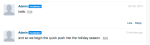
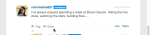

# 문자열 현지화{#localize-strings}

Livefyre 앱의 문자열 맞춤화

모든 Livefyre 앱에 있는 대부분의 HTML 요소에 대한 텍스트 문자열을 사용자 정의할 수 있습니다. 이렇게 하면 &quot;다른 이름으로 게시&quot; 단추, &quot;주석 수&quot; 텍스트 또는 &quot;로그인&quot; 버튼과 같은 렌더링된 HTML 요소의 텍스트를 유효한 UTF-8 문자열로 변경할 수 있습니다. 이 기능을 사용하여 스트림 구현에 개성을 추가하거나 사용자용 앱의 언어를 현지화합니다.

* 댓글, 채팅 및 라이브 블로그

   * [구현](#c-localize-strings/section_im4_224_xz)
   * [계정 액세스](#c-localize-strings/section_cm3_d24_xz)
   * [스트림 정보](#c-localize-strings/section_wx1_c24_xz)
   * [스트림 정렬](#c-localize-strings/section_ih2_124_xz)
   * [콘텐츠 정보](#c-localize-strings/section_llv_yd4_xz)
   * [주요 컨텐츠](#c-localize-strings/section_gmw_vd4_xz)
   * [텍스트 편집기](#c-localize-strings/section_ky5_td4_xz)
   * [응답 옵션](#c-localize-strings/section_zvt_qd4_xz)
   * [주석 알림 기능](#c-localize-strings/section_qqt_pd4_xz)
   * [오류 메시지](#c-localize-strings/section_omz_jxn_xz)

* [시간 및 날짜 형식](#c-localize-strings/section_yz4_g5n_xz)
* [미디어 벽](#c-localize-strings/section_vwt_d5n_xz)
* [맵](#c-localize-strings/section_fxv_c5n_xz)
* [모자이크](#c-localize-strings/section_e2s_b5n_xz)
* [회전판](#c-localize-strings/section_l2z_hkn_xz)
* [기능 카드](#c-localize-strings/section_mw2_hkn_xz)
* [투표](#c-localize-strings/section_pdg_fwh_xz)
* [Livefyre ID](#c-localize-strings/section_zc3_xvh_xz)
* 자세히:
   * [텍스트 문자열 검토](/help/using/c-settings-other/c-translation-sets/c-review-text-strings.md#c_review_text_strings)
   * [사이드노트](/help/using/c-settings-other/c-translation-sets/c-sidenotes-text-strings.md#c_sidenotes_text_strings)

## 구현 {#section_im4_224_xz}

이 기능을 구현하려면 재정의할 문자열의 1-1 개체 매핑을 JavaScript 구성 개체에 전달합니다. 필드를 제공하지 않으면 기본 텍스트가 사용됩니다.

예:

```
var customStrings = {     
   postAsButton: "New Post As Text",     
   postEditButton: "New Post Edit Text"  
};   
   convConfig["strings"] = customStrings; fyre.conv.load(     
   networkConfig,     
   [convConfig],     
   function(){}  
);
```

이 페이지에는 Livefyre 핵심 앱에 대해 사용자 지정할 수 있는 모든 텍스트 문자열이 나열됩니다.

## 계정 액세스 {#section_cm3_d24_xz}

인증 프로세스 및 인증된 사용자 메뉴에서 사용할 수 있는 문자열.


| 요소 | 키 | 기본 텍스트 |
|---|---|---|
|  | displayName | %s |
|  | editProfile | 프로필 편집 |
|  | notificationSettings | 알림 설정 |
|  | siteAdmin | Admin Console(Studio 링크) |
|  | signOut | 로그아웃 |

## 스트림 정보 {#section_wx1_c24_xz}

콘텐츠 스트림 정보 및 표시에 사용할 수 있는 문자열. 의견 수렴의 사람 수, 앱의 게시물 수를 나열하고, 사용자가 로그인하거나 계정 정보에 액세스할 수 있도록 합니다.

| 키 | 기본 텍스트 | 스트림 데이터 |
|---|---|---|
|  | commentCountLabelZero | %s 주석 |
|  | commentCountLabel | %s 주석 |
|  | commentCountLabelPlural | %s 주석 |
|  | listenerCount | 의견 수렴 |
|  | listenerCountPlural | 사람들이 듣는 소리 |
|  | liveblogPostCountLabelZero | 게시물 |
|  | liveblogPostCountLabel | 게시물 |
|  | liveblogPostCountLabelPlural | 개의 게시물 |
| 스레드 옵션 | threadBreakoutButton | 전체 스레드 표시 |
|  | toggleCollapse | 축소 켜기/끄기 |
| 높은 속도/대기 중인 주석 | 새로 고침 | 새로 고침 |
|  | newComment | 새 주석 |
|  | newComments | 새 주석 |
|  | newReply | 새 회신 |
|  | newReplies | 새 답글 |

## 스트림 정렬 {#section_ih2_124_xz}

사용자가 연령 또는 인기별로 반환된 컨텐츠를 정렬할 수 있습니다.


| 키 | 기본 텍스트 | 머리글 옵션 |
|---|---|---|
|  | sortLatest | 최신 |
|  | sort오래된 항목 | 가장 오래된 |
|  | sortTopComments | 상위 주석 |
|  | sortHotThreads | 핫 스레드 |
|  | sortSeparator |  |  |
|  | streamSorting | 로드 중 |
|  | topCommentsContentNotFoundMsg | 아직 좋아요 수가 부족합니다. |
|  | hotThreadsContentNotFoundMsg | 아직 실이 충분하지 않습니다. |
|  | streamRefreshMsg | 새로운 기능 보기 |
| 바닥글 옵션 | archiveHeaderTitle | 보관에서 |
|  | archiveShow자세히 | 자세히 표시 |
|  | showMore | 추가 주석 표시 |
|  | showMoreLiveblog | 더 많은 게시물 표시 |


## 콘텐츠 정보 {#section_llv_yd4_xz}

게시물 정보를 나열합니다.사용자 이름, 적용된 모든 사용자 태그 및 게시 시간

  

| 키 | 기본 텍스트 | Author |
|---|---|---|
|  | 중재자 | 중재자 |
|  | hovercardViewProfile | 전체 프로필 보기 |
| 게시물 정보 | timeJustNow | 지금 |
|  | timeMinutesAgo | 분 전 |
|  | timeMinutesAgoPlural | 분 전 |
|  | timeHoursAgo | 시간 전 |
|  | timeHoursAgoPlural | 시간 전 |
|  | timeDaysAgo | 일 전 |
|  | timeDaysAgoPlural | 일 전 |
|  | liketsPlural | 좋아요 |
|  | liketsSingular | 좋아요 |
|  | scansorerEditTimestamp | 중재자가 편집함 |
|  | commentTomarstone | 이 주석이 삭제되었습니다. |
|  | permalinkNotFoundMsg | 이 주석은 더 이상 표시되지 않습니다. |
|  | quickProfileTooltip | 빠른 프로필 |

## 주요 내용 {#section_gmw_vd4_xz}

활성화되면 주요 컨텐츠가 스트림 맨 위에 나열됩니다.

|  | 키 | 기본 텍스트 |
|---|---|---|
| 주요 레이블 |  |  |
|  | featuredCommentsTag | 주요 기능 |
|  | featuredCommentsTitlePlural | 주요 주석 |

## 텍스트 편집기 {#section_ky5_td4_xz}

기본적으로 모든 사용자에 대해 페이지 맨 위에서 사용할 수 있습니다.


|  | 키 | 기본 텍스트 |
|---|---|---| 
| 편집기 단추 | follow | + 팔로우 |
|  | 팔로우 취소 | - 팔로우 취소 |
|  | liveblog팔로우 | 라이브 블로그 팔로우 |
|  | liveblog팔로우 취소 | 실시간 블로그 팔로우 취소 |
|  | postButton(로그인한 사용자가 사용할 수 있음) | 댓글 게시 |
|  | postAsButton(인증되지 않은 사용자가 사용할 수 있습니다.) | 댓글 게시 형식.. |
|  | postEditButton | 주석 편집 |
|  | postEditAsButton | 주석 편집... |
|  | postEditCancelButton | 취소 |
|  | editorDisabled | 이 대화는 현재 새 주석으로 마감되었습니다. |
| 채팅 옵션 | livechatPostButtonLabel | 게시물 |
|  | livechatPostEditButton | 편집 |
|  | livechatWindowsInstruction | 게시하려면 Ctrl+Enter 키를 누릅니다. |
|  | livechatOtherInstruction | 게시하려면 command+enter를 누릅니다. |

## 응답 옵션 {#section_zvt_qd4_xz}

별도의 언급이 없는 한 로그인한 모든 사용자가 사용할 수 있습니다. 액세스하려면 콘텐츠 패널 위로 마우스를 가져갑니다.


| 키 | 기본 텍스트 |  |
|---|---|---|
| 사용자 응답 옵션 | 최종 사용자가 사용할 수 있습니다. |  |
| flagButton | 플래그 |
|  | flagCommentTooltip | 플래그 |
|  | editButton(활성화된 경우 작성자 및 중재자만 사용 가능) | 편집 |
|  | deleteButton(활성화된 경우 작성자 및 중재자만 사용 가능) | 삭제 |
|  | deleteCommentTooltip | 삭제 |
|  | shareButton | 공유 |
|  | shareCommentTooltip | 공유 |
|  | likeButton | 좋아요 |
|  | unlikeButton | 좋아요 취소 |
|  | replyButton | 답글 |
|  | replyButtonSingular(채팅 및 라이브 블로그에 사용 가능) | 답글 |
|  | replyButtonPlural(채팅 및 라이브 블로그에 사용 가능) | 답글 |



| 키 | 기본 텍스트 |  |
|---|---|---|
| Flag Modal | flagTitle | %s의 댓글에 플래그 지정 |
|  | flagSubtitle | 플래그 |
|  | flagDefaultSelectOption | 선택 |
|  | flagSpam | 스팸 |
|  | flagSpamButton | 스팸 |
|  | flagSpamCommentTooltip | 스팸 |
|  | flagOffensive | 공격 |
|  | flagOffensiveButton | 공격 |
|  | flagOffensiveCommentTooltip | 공격 |
|  | flagUnagree | 반대 |
|  | flagUnagreeButton | 반대 |
|  | flagDisceptCommentTooltip | 반대 |
|  | flagOffTopic | 주제 해제 |
|  | flagOfftopicButton | 주제 해제 |
|  | flagOfftopicCommentTooltip | 주제 해제 |
|  | flagEmail | 이메일 |
|  | flagEmailPlaceholder | you@example.com |
|  | flagNotes | 참고 |
|  | flagNotesPlaceholder | 여기에 입력 시작.. |
|  | flagConfirmButton | OK |
|  | flagCancelButton | 취소 |
|  | flagConfirmationMessage | %s의 주석을 %s(으)로 플래깅하시겠습니까? |
|  | flagSuccessMsg | 댓글에 플래그가 지정되었습니다. |


| 키 | 기본 텍스트 |  |
|---|---|---|
| 양식 공유 | shareTitle | 주석 공유 |
|  | sharePlaceholderText | 어떻게 생각해? |
|  | shareLabel | 공유 위치: |
|  | shareTextTwitter | blank |
|  | shareTextFacebook | 비어 있음 |
|  | shareTextLinkedin | 비어 있음 |
|  | shareButtonText | 공유 |
|  | sharePermalink | 페르말링크 |
|  | loadingPermalink | 짧은 URL 로드 중... |
|  | shareText | 방금 댓글을 올렸어요 확인! |


| 키 | 기본 텍스트 |  |
|---|---|---|
| 회신 양식 | postReplyAsButton | 댓글 게시 형식.. |
|  | postReplyButton(로그인한 사용자가 사용할 수 있음) | 댓글 게시 |
|  | backToHotThreads | 핫 스레드로 돌아가기 |


| 키 | 기본 텍스트 |  |
|---|---|---|
| Twitter @mention | menusTitle | 언급 공유 |
|  | mentionSubtitleTwitter | 트윗 공유 대상: |
|  | menusDefaultText | Livefyre의 댓글에서 언급한 적이 있습니다. |
|  | mentingConfirmButton | 확인 |
|  | mentingCancelButton | 취소 |
|  | mentingErrorGeneral | 이런! 문제가 발생했습니다. Livefyre에 경고가 표시되었습니다. |
|  | menusErrorNoneSelected | 적어도 하나의 언급이 활성화되어 있어야 합니다. |
|  | menusMenuTitle | 친구를 보고 언급하는 방법 |
|  | mentingTwitterConnect | twitter에 연결 |
|  | mentionTwitterFetch | 친구를 가져오는 중... |
|  | mentingSuccessMsg | 언급이 성공적으로 전송되었습니다. |


| 키 | 기본 텍스트 |  |
|---|---|---|
| 양식 편집 | Studio 관리자, 사용자 관리자 또는 중재자가 사용할 수 있습니다. |  |
| @(@mention.) | &lt;/>(사용자 정의 html 창을 엽니다.) |  |
|  | customHtmlDialogTitle(모달용 머리글로 나타납니다.) | 사용자 지정 HTML 추가 |


| 키 | 기본 텍스트 |  |
|---|---|---|
| 중재자 응답 옵션 | Studio 관리자, 사용자 관리자 또는 중재자가 사용할 수 있습니다. |  |
| pendingComment | pending |
|  | vanUserButton | 사용 금지 |
|  | 반기사용자 도구 설명 | 사용 금지 |
|  | bozoButton | 보조 |
|  | bozoCommentTooltip | 보조 |
|  | featureButton | 기능 |
|  | featureCommentTooltip | 기능 |
|  | unfeatureButton | 기능 해제 |
|  | featuredCommentTooltip | 기능 해제 |


| 키 | 기본 텍스트 |  |
|---|---|---|
| 사용자 양식 금지 | Studio 관리자, 사용자 관리자 또는 중재자가 사용할 수 있습니다. |  |
| 금지 제목 | 사용 금지 |  |
|  | 금지 확인 | 이 사용자를 금지하시겠습니까? |
|  | vanConfirmButton | 확인 |
|  | 반기취소 단추 | 취소 |

## 주석 알림 기능 {#section_qqt_pd4_xz}

활성화된 경우 모든 Livefyre 대화 앱에 대해 페이지 하단에서 사용할 수 있습니다.


|  | 키 | 기본 텍스트 |
|---|---|---|
| 알림 기능 레이블 | commentNotifier | 새 주석 |
|  | commentNotifierPlural | 새 주석 |
|  | liveblogNotifier | 새 게시물 |
|  | liveblogNotifierPlural | 새 게시물 |

## 오류 메시지 {#section_omz_jxn_xz}

사용자 정의 가능한 오류 메시지에 사용할 수 있는 문자열.

| 키 | 기본 텍스트 |
|---|---|
| errorAuthError | 이 대화에 대한 의견을 게시할 권한이 없습니다. |
| errorCommentsNotAllowed | 이 대화에서는 주석을 사용할 수 없습니다. |
| errorDefault | 오류가 발생했습니다. 다시 시도하십시오. |
| errorDuplicate | 의견은 마음에 드는 만큼 두 번 게시할 수 없습니다. |
| errorEditDuplicate | 주석을 편집할 때 주석 본문을 변경해야 합니다. |
| errorEditNotAllowed | 이 대화에 대한 주석을 편집할 수 없습니다. |
| errorEditTimeExceeded | 죄송합니다. 댓글 편집 기간이 만료되었습니다. |
| errorEmpty | 빈 댓글을 게시하려고 하는 것 같습니다. |
| errorExpired | 세션이 만료되었습니다. 페이지를 다시 로드하십시오. |
| errorFlagNotSelected | 플래그 유형을 선택하십시오. |
| errorGuestLiked | 죄송합니다. 계정이 있는 사용자만 콘텐츠를 좋아할 수 있습니다. |
| errorIncumentPermissions | 권한 부족 |
| errorInvalidChar | 잘못된 문자를 게시하려고 하는 것 같습니다. |
| errorLikeOwnComment | 자신의 의견은 마음에 들지 않는다 |
| error잘못된 형식 | 잘못된 형식의 콘텐츠를 게시하려고 하는 것 같습니다. |
| errorMaxChars | 죄송합니다. 주석이 너무 깁니다. 편집하고 다시 시도하십시오. |
| errorMediaNotAvailable | 미디어가 더 이상 표시되지 않습니다. |
| errorShowMore | 주석을 더 로드하는 동안 오류가 발생했습니다. |
| MultipleMediaNotAllowedError | 권한은 한 번에 하나의 미디어 첨부 파일만 부여합니다. |

## 시간 및 날짜 형식 {#section_yz4_g5n_xz}

시각화 앱 내에서 컨텐트 카드에 날짜가 표시되는 방식을 번역 및 사용자 정의합니다.

| 키 | 기본 텍스트 |
|---|---|
| hoursAgo | {number}h |
| hoursAgoSingular | {number}h |
| 지금 | 1 |
| minutesAgo | {number}m |
| minutesAgoSingular | {number}m |
| monthDayFormat | {day} {monthAbbrev} |
| monthDayYearFormat | {day} {monthAbbrev} {year} |
| monthNames | 1월, 2월, 3월, 4월, 5월, 6월, 7월, 8월, 9월, 10월, 11월, 12월 |
| monthNamesAbbrev | 1월, 2월, 3월, 4월, 5월, 6월, 7월, 8월, 9월, 10월, 12월 |
| secondsAgo | {number}s |
| secondsAgoSingular | {number}s |

## 미디어 벽 {#section_vwt_d5n_xz}

미디어 담벼락 앱에 사용할 수 있는 문자열.

| 키 | 기본 텍스트 |
|---|---|
| featuredText | 주요 기능 |
| shareButtonText | 공유 |

| 키 | 기본 텍스트 |
|---|---|
| postButtonText | 무슨 생각이에요? |
| postModalTitle | 댓글 게시 |
| postModalButton | 댓글 게시 |
| postModalPlaceholder | 무슨 말을 하고 싶으세요? |
| showMoreButtonText | 추가 로드 |
| shareButtonText | 공유 |

## 맵 {#section_fxv_c5n_xz}

맵에 사용할 수 있는 문자열.

| 키 | 기본 텍스트 |
|---|---|
| featuredText | 주요 기능 |
| shareButtonText | 공유 |

## 모자이크 {#section_e2s_b5n_xz}

Mosaics에 사용할 수 있는 문자열입니다.

| 키 | 기본 텍스트 |
|---|---|
| featuredText | 주요 기능 |
| shareButtonText | 공유 |

## 회전판 {#section_l2z_hkn_xz}

회전판에 사용할 수 있는 문자열.

| 키 | 기본 텍스트 |
|---|---|
| featuredText | 주요 기능 |
| shareButtonText | 공유 |

## 기능 카드 {#section_mw2_hkn_xz}

기능 카드에 사용할 수 있는 문자열.

| 키 | 기본 텍스트 |
|---|---|
| featuredText | 주요 기능 |
| shareButtonText | 공유 |

## 앱 업로드 {#section_grc_gkn_xz}

업로드 앱에 사용할 수 있는 문자열.

| 키 | 기본 텍스트 |
|---|---|
| postButtonText | 무슨 생각이에요? |
| postModalTitle | 댓글 게시 |
| postModalButton | 댓글 게시 |
| postModalTitlePlaceholder | 제목 입력 |
| postModalPlaceholder | 무슨 말을 하고 싶으세요? |
| postModalConfirationTitle | 게시해 주셔서 감사합니다! |
| postModalConfirmationMessage | 귀하의 게시물을 검토 중입니다. |
| postModalConfirmationButton | 완료 |
| title |  |
| message |  |
| editorErrorAttachmentsRequired | 첨부 파일이 필요합니다. |
| editorErrorBody | 메시지를 추가하십시오. |
| editorErrorDuplicate | 원하는 만큼 두 번 게시할 수 없습니다 |
| editorErrorGeneric | 오류가 발생했습니다. |
| editorErrorTitleRequired | 제목이 필요합니다. |

## 투표 {#section_pdg_fwh_xz}

투표에 사용할 수 있는 문자열.

| 키 | 기본 텍스트 |
|---|---|
| totalVotesLabel | 총 투표 수 |
| shareStringText | %s에서 투표한 투표 결과가 무엇입니까? |
| pollClosedLabel | 이 설문 조사는 현재 닫혀 있습니다. |

## Livefyre ID {#section_zc3_xvh_xz}

Livefyre ID에 사용할 수 있는 문자열.

| 키 | 기본 텍스트 |
|--- |--- |
| automaticallyFollowConversations | 자동으로 대화 팔로우 |
| back | 뒤로 |
| 소개 | 소개 |
| create | 선택 사항에서 |
| createAnNewAccount | 새 계정 만들기 |
| createNewAccountWithEmail | 이메일로 새 계정 만들기 |
| changeAvatar | 아바타 변경 |
| chooseFile | 파일 선택 |
| completeAccount | 전체 계정 |
| emailWhenSomeoneReplies | 누군가 나에게 답글을 남길 때 이메일 |
| emailCommentsIFollow | 팔로우하는 대화에서 이메일 댓글 |
| emailSentoResetPassword | 이메일 전송! 받은 편지함에서 암호를 재설정하는 링크를 확인하십시오. |
| emailVerificationSent | 이메일 확인 전송 |
| firstName | 이름 |
| forgotPassword | 암호를 잊으셨습니까? |
| forgotYourPassword | 암호를 잊으셨습니까? |
| forgotYourPasswordInstructions | 아래에 사용자 이름 또는 이메일 주소를 입력하면 암호를 변경할 링크가 전송됩니다. |
| formInputCloseButtonText | 닫기 |
| formInputCancelButtonText | 취소 |
| formInputSaveButtonText | 저장 |
| hasNotLeftAnyComments | 댓글 남김없이 |
| locationIsFrom | 에서 |
| labelAvatar | 아바타 |
| labelComments | 설명 |
| labelConfirmNewPassword | 새 암호 확인 |
| labelConfirmPassword | 암호 확인 |
| labelEmail | Email Address |
| labelLikes | 좋아요 |
| labelLoading | 로드 중 |
| labelNewPassword | 새 암호 |
| labelNotification | 알림 |
| labelPassword | 암호 |
| labelProfile | 프로필 |
| labelUsername | 사용자 이름 |
| labelUsernameOrEmail | 사용자 이름 또는 이메일 |
| lastName | 성 |
| livefyreAccount | Livefyre 계정 |
| 위치 | 위치 |
| loadingProfile | 프로필 로드 중 |
| newPassword | 새 암호 |
| oldPassword | 이전 암호 |
| on | on |
| 또는  | 또는  |
| passwordLinkExpired | 암호를 재설정하기 위해 클릭한 링크가 만료되었습니다. 암호를 다시 설정하면 새 링크가 전송됩니다. |
| pleecheckEmailToComplete | 등록을 완료하려면 이메일을 확인하십시오. |
| 게시됨 | 게시됨 |
| poweredBy | powered by |
| profileNotificationImmediate | immediate |
| profileNotificationHourly | 시간별 |
| profileNotificationNever | never |
| 최근 댓글 | 최근 댓글 |
| 재설정 | 재설정 |
| resetPassword | 암호 재설정 |
| signIn | 로그인 |
| signInWith | 다음으로 로그인 |
| signInWithEmail | 이메일로 로그인 |
| signUp | 등록 |
| social계정 | 소셜 계정 |
| successPasswordChanged | 성공! 암호가 변경되었으며 이제 로그인되었습니다. |
| termsAndConditions | 약관 |
| termsAndConditionsIntro | 등록하면 |
| termsOfUse | 사용 약관 |
| termsOfUseIntro | 로그인하면 |
| thisUser | 이 사용자 |
| verifyPassword | 암호 확인 |
| fileSizeLimit | 최대 2MB |
| 계정을 찾을 수 없음 | 계정을 찾을 수 없음 |
| avatarImageExceptSize | 아바타 이미지가 2mb 파일 제한을 초과합니다. |
| 필수 | 필드에는 정수만 사용할 수 있습니다. |
| fieldacceptsavalidemail | 유효한 이메일만 필드가 수락합니다. |
| fieldacceptletters | 필드에는 글자만 입력할 수 있습니다. |
| filesizemstbelessthanMB | 파일 크기는 {#}MB보다 작아야 합니다. |
| invalidusername 또는 password | 잘못된 사용자 이름 또는 암호 |
| 최소 문자 수 | {#}자 최소 길이 |
| 최대 문자 수 | {#}자 최대 길이 |
| therwesanerror | 오류가 발생했습니다. |
| thisfieldisrequired | 이 필드는 필수입니다. |
| 유효성 검사 파일 확장 | 유효한 파일 확장명 |
| valuemustmatch | 값이 일치해야 함 |
| passwordLength | 6~32자 길이입니다. |
| passwordCharacters | 소문자와 대문자 모두 포함 |
| passwordSymbols | 하나 이상의 숫자와 기호를 포함합니다. |
| passwordUsername | 사용자 이름을 포함하지 않습니다. |
| passwordPopoverTitle | 암호는 다음과 같습니다. |
| passwordErrorContainsFirstName | 입력한 암호는 사용자 이름, 이름 또는 성을 포함합니다. 보안상의 이유로 사용자 이름, 이름 또는 성을 포함하지 않는 암호를 입력하십시오. 암호는 다음을 포함해야 합니다.6~32자 대문자 A 소문자 A 기호 |
| passwordErrorContainsLastName | 입력한 암호는 사용자 이름, 이름 또는 성을 포함합니다. 보안상의 이유로 사용자 이름, 이름 또는 성을 포함하지 않는 암호를 입력하십시오. 암호는 다음을 포함해야 합니다.6~32자 대문자 A 소문자 A 기호 |
| passwordErrorContainsUsername | 입력한 암호는 사용자 이름, 이름 또는 성을 포함합니다. 보안상의 이유로 사용자 이름, 이름 또는 성을 포함하지 않는 암호를 입력하십시오. 암호는 다음을 포함해야 합니다.6~32자 대문자 A 소문자 A 기호 |
| passwordErrorTooShort | 암호를 위한 최소 6자 |
| passwordErrorTooLong | 암호에는 최대 32자 |
| passwordErrorMissingUppercase | 암호는 대문자를 하나 이상 포함해야 합니다. |
| passwordErrorMissingLowercase | 암호는 소문자를 하나 이상 포함해야 합니다. |
| passwordErrorMissingSymbol | 암호는 `!@#$%^&*()?.,<>\’;:”[]{}|` 집합에 하나 이상의 기호를 포함해야 합니다. |
