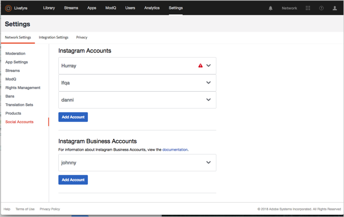
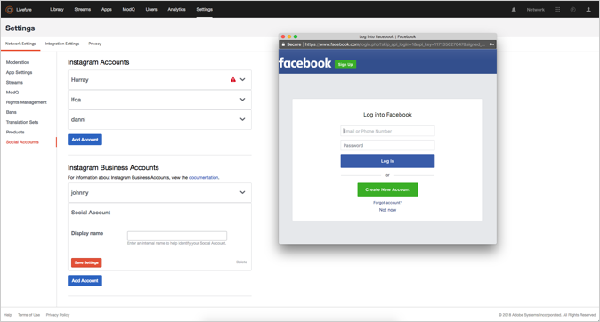

# 소셜 계정 추가{#add-a-social-account}

스트림 또는 소셜 검색에서 UGC를 요청하거나 권한을 요청하도록 Social 계정을 구성합니다.

Livefyre는 Twitter 및 Instagram 소셜 계정을 사용하여 라이브러리에서 소셜 검색을 수행하거나 스트림을 사용할 수 있도록 합니다.

라이브러리에서 Twitter 소셜 검색을 사용하려면 Twitter에서 계정을 구성해야 합니다.

Adobe Livefyre 사용 방법에 따라 Instagram는 소셜 계정에 대한 다른 규칙을 가집니다. Livefyre와 함께 사용할 수 있는 소셜 계정 유형에 대한 자세한 내용은 Instagram 계정 [정보를](/help/using/c-users-creating-accounts-with-studio-access/t-configure-social-accout-instagram/c-about-instagram-accounts.md#c_about_instagram_accounts)참조하십시오.

Social 계정을 구성하려면:

1. Navigate to **[!UICONTROL Settings >]****[!UICONTROL Network Settings.]**
1. 아래 **[!UICONTROL Social Accounts]** 섹션으로 이동합니다 **[!UICONTROL Network Settings]**.
1. 추가할 소셜 계정 **[!UICONTROL Add Account]** 유형 아래에서 클릭합니다. Livefyre의 계정을 승인할 수 있는 대화 상자가 나타납니다.

   

   >[!NOTE]
   >
   >Instagram 비즈니스 계정을 구성하면 Facebook 로그인 화면으로 이동됩니다. 정상적으로 로그인을 계속합니다.  >

1. **[!UICONTROL Authorize App]** 계속하려면을 클릭합니다.
1. 계정에 **[!UICONTROL Display Name]** 대해 A를 추가한 다음을 클릭합니다 **[!UICONTROL Save Settings.]**. 계정 정보 상자의 **[!UICONTROL Social Account]** 헤더에서를 클릭하여 계정을 축소합니다.
