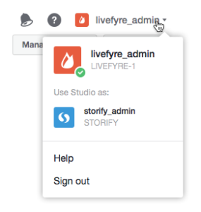

# 네트워크 전환 사용자{#users-switching-networks}

단일 Studio 계정에서 여러 네트워크를 관리할 수 있습니다.

>[!NOTE]
>
>흔한 일은 아닙니다.

풀다운 **[!UICONTROL Account]** 메뉴에는 현재 로그인되어 있는 Studio 계정과 연결된 모든 사용자 이름과 해당 사용자 이름과 연결된 네트워크가 나열됩니다. 이 풀다운을 사용하여 관리할 네트워크를 선택합니다.

>[!NOTE]
>
>대부분의 사용자는 단일 네트워크에만 권한을 가지지만 일부 Studio 사용자는 여러 사이트를 소유하거나 중재할 수 있습니다. Studio 계정을 사용하면 하나의 사용자 이름과 암호로 로그인한 다음 여러 사이트 액세스 수준 간을 전환할 수 있습니다.

