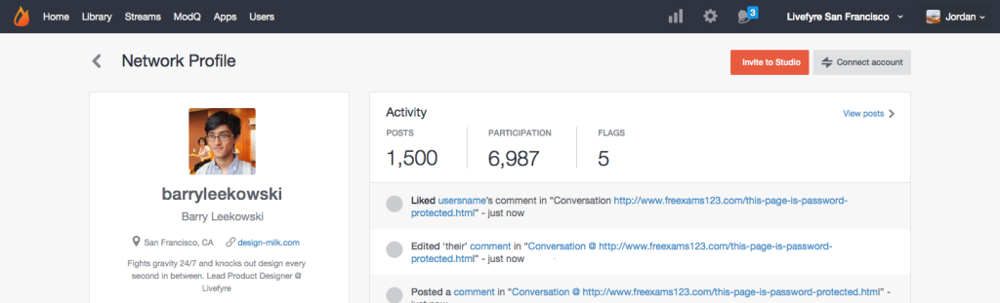

# 사용자 계정 연결{#link-user-accounts}

Studio 계정을 Livefyre 계정에 연결하여 한 곳에서 모든 Livefyre 사이트 또는 네트워크를 중재하거나 관리할 수 있습니다.

>[!NOTE]
>
>Livefyre 앱과 상호 작용하려면(예: 댓글을 남기거나, Sideconte를 추가하거나, 콘텐츠를 공유하는 경우) Studio 계정 사용자 이름과 암호가 아닌 Livefyre 계정 사용자 이름과 암호를 사용하여 로그인해야 합니다.

계정을 연결하려면

1. 네트워크에서 Livefyre 사용자 프로필을 만든 후 Studio에 로그인합니다.
1. 이동하여 사용자 프로필을 **[!UICONTROL Users]**&#x200B;찾은 다음 두 번 클릭하여 세부 사항을 봅니다.
1. 클릭 **[!UICONTROL Connect account]**.
1. 표시되는 창에서 이 계정에 연결할 사용자 계정을 선택합니다.
1. 정보를 확인하고 **[!UICONTROL Link Profile]** 을 클릭합니다 **[!UICONTROL Link]**. 

