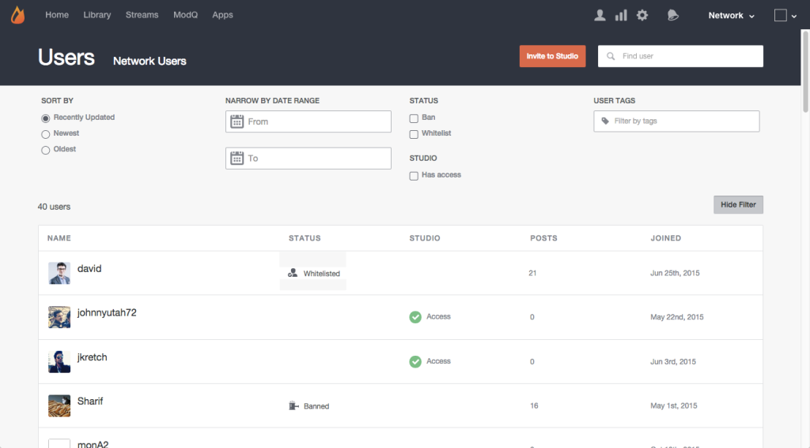

# 사용자 검색{#search-for-users}

페이지 맨 위에 있는 검색 필드를 사용하여 표시 이름, 사용자 ID, 이메일 주소 또는 Livefyre 네트워크에 가입한 날짜별로 사이트 방문자를 검색합니다.

>[!NOTE]
>
>이러한 필드는 와일드카드 검색을 지원합니다.

1. 나열된 사용자가 필터링될 수 있는 패널을 열려면을 **[!UICONTROL Show Filter]** 클릭합니다.
1. **[!UICONTROL Sort by]** 나열된 사용자 계정 업데이트: 최근 업데이트됨, 최신 또는 가장 오래된 것 중 가장 오래된 것.
1. **[!UICONTROL Narrow by Date Range]** 를 클릭하여 입력 범위 중에 추가된 사용자 계정만 나열합니다.
1. 목록만 또는 **[!UICONTROL Banned]****[!UICONTROL Whitelisted]** 사용자를 참조하십시오.
1. 사용자 수만 **[!UICONTROL Studio]** 나열.
1. 첨부된 입력이 **[!UICONTROL User Tags]** 있는 계정만 나열합니다. 

